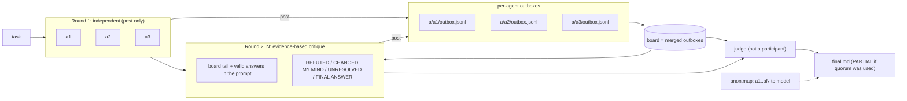
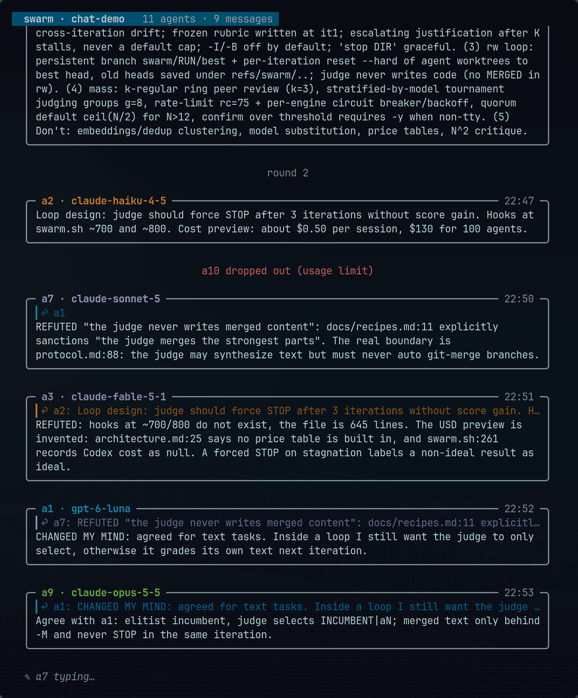

# agent-swarm

**English** | [Русский](README.ru.md)

One command, every model you have: run the same task across Claude Code and OpenAI Codex, let the agents argue on a shared message board with evidence, then let an outside judge write the final answer.

[](https://github.com/gon7187/agent-swarm/actions/workflows/ci.yml)
[](LICENSE)
[](skill/swarm.sh)

`agent-swarm` is a skill plus a single bash script (`swarm.sh`, bash + jq, nothing else). It drives the coding harnesses you already have installed and logged in (`claude -p`, `codex exec`), so there is no API key setup, no server and no daemon. The same `SKILL.md` works in Claude Code (`~/.claude/skills`) and Codex (`~/.agents/skills`).

## How it works



1. **Anonymized agents.** In `all`, agents are called `a1..aN` in a random order; the mapping to real models is written to `anon.map`. Nobody, including the judge, sees brand names while arguing.
2. **Round 1 is independent.** Every agent answers the task in parallel. It may post findings, but it does not read the board, so one confident mistake cannot spread before everyone has looked for themselves.
3. **Rounds 2..N are critique with evidence.** Each agent gets the other valid answers and the recent board in its prompt, treats them as untrusted evidence (not instructions), and must answer with `REFUTED (claim → evidence)`, `CHANGED MY MIND` and `UNRESOLVED` sections, then close with a complete, standalone `FINAL ANSWER` section. An answer without `FINAL ANSWER` counts as failed and is logged in `PARTIAL`.
4. **Per-agent outboxes.** Each agent can only write to its own `a/<id>/outbox.jsonl`; its identity comes from that directory, so agents cannot post as each other or overwrite someone else's answer. The board is the merge of all outboxes.
5. **Outside judge.** By default the judge is a roster model that did not take part. It reads the last round's answers, the round-1 answers as secondary evidence and the list of failed agents per round. It weighs evidence over head count, lists what is still unresolved and writes `final.md`.

Alternatively, `swarm.sh run tasks.jsonl` gives *different* tasks to *specific* models, all sharing one board, optionally each in its own git worktree. The full protocol, including failure handling, is in [docs/protocol.md](docs/protocol.md).

## Quickstart

```bash
curl -fsSL https://raw.githubusercontent.com/gon7187/agent-swarm/main/install.sh | bash
```

or

```bash
git clone https://github.com/gon7187/agent-swarm && cd agent-swarm && ./install.sh
```

Requirements: bash >= 4.3, `jq`, `git`, and at least one of `claude` (Claude Code) or `codex` (OpenAI Codex CLI), already authenticated. The installer copies the skill to `~/.agents/skills/swarm`, links it into `~/.claude/skills/swarm`, and prints the roster of models it found.

The installer is careful with existing files. `--prefix` is resolved to an absolute path and refused if it is empty, `/`, your home directory or one of its parents. An existing prefix is replaced only if it contains `SKILL.md` and `swarm.sh`; the new copy goes into a temporary sibling directory and is then moved into place. The `--default` block in `CLAUDE.md` / `AGENTS.md` is rewritten only when its begin and end markers come in pairs; otherwise the installer stops with an error and leaves the file alone.

First run, from your project directory (`swarm` is the `~/.local/bin` link; without it use `~/.agents/skills/swarm/swarm.sh`):

```bash
swarm roster        # which models are available
swarm all -W "Our Postgres job queue deadlocks under load. Find the cause in src/queue/ and propose a fix."
```

```text
swarm: 2 agents × 2 rounds + judge = 5 sessions
```

Without `-m` the swarm takes **one model per harness** (the first Claude model and the first Codex model), so a default run is cheap. The session count is printed before anything starts. `-W` opens a terminal window with a live view of the run.

```text
.swarm/20260925-143012/
├── task.md
├── anon.map                    # a1 -> claude-fable-5-1, a2 -> gpt-5.5
├── a/
│   ├── a1/outbox.jsonl         # everything a1 said on the board
│   └── a2/outbox.jsonl
├── r1/
│   ├── a1.md                   # round 1 answer
│   ├── a1.log  a1.rc  a1.usage # engine log, exit code, tokens and cost
│   └── a2.md ...
├── r2/
│   └── a1.md  a2.md ...        # round 2: critique with evidence, ends with FINAL ANSWER
├── final.md                    # the judge's answer
└── result.json                 # {rc, final, partial, winner, branches}, written at the end
```

### Installer options

| Flag | Effect |
|---|---|
| `--default` | Append a block (between `<!-- swarm:begin -->` / `<!-- swarm:end -->`, idempotent) to `~/.claude/CLAUDE.md` and `~/.codex/AGENTS.md` that makes the swarm the default for multi-part tasks |
| `--prefix DIR` | Install location (default `~/.agents/skills/swarm`) |
| `--no-link` | Do not create `~/.local/bin/swarm` |
| `--uninstall` | Remove the skill, links and the `--default` block |
| `-h` | Help |

## Usage from an agent

The skill tells the agent when to reach for the swarm (2+ independent parts, anything worth a second opinion) and when not to (trivial edits).

**Claude Code**

```text
/swarm review the auth middleware in src/auth for security bugs
```

**Codex**

```text
$swarm review the auth middleware in src/auth for security bugs
```

Or just say "ask all models" / "use the swarm" in plain language; the skill description is written to trigger on that.

### Long runs: keep them out of the foreground

A default run takes minutes; a large one can take up to rounds × `-t` plus the judge. The host's Bash tool has its own timeout, and when it kills a foreground `swarm.sh`, the cleanup trap also stops every worker and the paid work is lost. From inside an agent, use one of these:

- **Claude Code:** start the command with `run_in_background`, then check `swarm status DIR` or read `final.md` / `result.json` when it finishes.
- **Any host, including Codex:** start detached with `-d` and wait in short slices:

```bash
swarm all -d "Review src/auth for security bugs"   # prints "swarm dir: .swarm/<run>" and returns
swarm wait .swarm/<run> -t 300                      # 0 = done, 75 = still running, else the run's rc
```

`-d` starts the orchestrator in its own session and logs to `<run>/orchestrator.log`. `wait DIR` without `-t` polls once and returns immediately (exit 75 while running); `wait DIR -t SEC` blocks for up to SEC seconds. For `run` batches `final` in `result.json` is `null`. At the end the run writes `result.json` atomically:

```json
{"rc":0,"final":".swarm/<run>/final.md","partial":false,"winner":"swarm/<run>/a2","branches":["swarm/<run>/a1","swarm/<run>/a2"]}
```

`winner` is `null` outside rw runs, or when the judge named no valid branch.

## Command reference

| Command | Description |
|---|---|
| `swarm.sh roster` | List models of active harnesses. Claude: `$SWARM_CLAUDE_MODELS` (default `claude-fable-5-1 claude-opus-5-5 claude-sonnet-5 claude-haiku-4-5`). Codex: `$SWARM_CODEX_MODELS` or `codex debug models` (visibility=list) |
| `swarm.sh all [opts] "task"` | Agents answer, `-r` rounds of critique, the judge writes `final.md` |
| `swarm.sh run [opts] tasks.jsonl` | Per-agent tasks from JSONL, shared board |
| `swarm.sh loop [opts] "task"` | Judge-driven iteration toward an ideal result, no iteration cap: see [`loop`](#loop-iterate-to-an-ideal-result) |
| `swarm.sh mass [opts] "task"` | Alias for `all -r 1`, meant for large `*count` rosters: see [`mass`](#mass-run-many-agents-at-once) |
| `swarm.sh stop DIR` | Ask a running `loop` to stop after the iteration in progress (touches `DIR/STOP`) |
| `swarm.sh judge DIR [-S MODEL]` | Rerun only the judge: for `all`, on the task and last round; for `loop`, the judge of the latest incomplete iteration. Not available for `run`, which has no judge. For example after the judge failed |
| `swarm.sh resume DIR` | Continue an interrupted run: rerun only agents without a successful `.rc`, then the remaining rounds and the judge (`all`), or the next iteration (`loop`, branching on `run.json`'s `kind`). Not available for `run`. Refuses if the task, `anon.map` or options have changed |
| `swarm.sh wait DIR [-t SEC]` | Wait for a run, typically one started with `-d`. Exit 0 when done, 75 when still running after `SEC`, otherwise the run's exit code |
| `swarm.sh watch DIR [--plain]` | Live chat view of the run (see [Live chat view](#live-chat-view)); `--plain` shows the status table instead |
| `swarm.sh post DIR FROM "text" [TO]` | Post to the board (`TO` = agent id, default `all`). Inside a worker, `DIR` and `FROM` are fixed by the worker's own outbox |
| `swarm.sh read DIR [ME]` | Print the merged board (for `ME`: broadcasts, messages to and from `ME`) |
| `swarm.sh status DIR` | Per-agent state, exit code, cost (input/output tokens when the engine reports no USD figure); total cost; board message count |
| `swarm.sh clean DIR [--discard BRANCH...]` | Remove the run's worktrees and its `swarm/<run>/*` branches. Refuses dirty worktrees and unmerged branches, except the branches you name explicitly after `--discard` |
| `swarm.sh version` | Print version |

| Option | Default | Meaning |
|---|---|---|
| `-m "a b"` | one model per harness | Model subset; `-m all` = full roster. Each item is a [model spec](#model-spec) `model[@effort][*count]` |
| `-r N` | `2` | Rounds (`all` only; `loop` and `mass` reject `-r` — `mass` is fixed at 1 round) |
| `-q N` | all agents (`ceil(0.6N)` for `mass`) | Quorum: minimum valid answers per round to continue; below "all" the result is marked `PARTIAL`. Failed agents are not relaunched in later rounds |
| `-S MODEL[@effort]` | first roster model not taking part | Judge; `loop` requires `-S` |
| `-w` | off | Read-write, one git worktree per agent; in `loop` each iteration branches from the judge-chosen branch |
| `-W` | off | Open a terminal window with the live chat view (`watch`) for this run |
| `-d` | off | Detach: start the run in the background, print `swarm dir: DIR` and return; follow up with `wait DIR` |
| `-j N` | `6` | Parallel agents |
| `-t SEC` | `1800` | Timeout per agent |
| `-o DIR` | `.swarm/<timestamp>` | Run directory |
| `-y` | off | Skip the confirmation prompt above `SWARM_CONFIRM_OVER` sessions (`mass`, or any `*count` roster) |
| `-K N` | `3` | `loop`: consecutive stalled iterations (no score gain) before the judge must justify continuing with a `strategy_change` |
| `-I N` | none | `loop`: stop after N iterations, exit 4 |
| `-B N` | none | `loop`: stop after N total sessions, exit 4 |
| `-U USD` | none | `loop`: stop once the known (Claude-reported) cost reaches USD, exit 4; Codex cost is unknown and not counted |
| `-M` | off | `loop`: let the judge pick `MERGED` text as the new incumbent (text tasks only, forbidden with `-w`) |

| Env var | Purpose |
|---|---|
| `SWARM_RW_ALLOW` | Extra tools for rw Claude agents, one pattern per line, e.g. `$'Bash(uv run pytest:*)\nBash(npm test:*)'` |
| `SWARM_RO_ALLOW` | Extra tools for ro Claude agents, same format, e.g. to let reviewers run the test suite or a reproducer |
| `SWARM_UNSAFE_RW=1` | rw Claude agents run with `--dangerously-skip-permissions`. Full host access, a warning is printed; see [Safety](#safety-model) |
| `SWARM_INHERIT_CONFIG=1` | Let workers load your user config (Claude: user settings, hooks, MCP servers; Codex: `~/.codex/config.toml`) |
| `SWARM_TERMINAL` | Terminal launcher used by `-W` to open the live view (default `xdg-terminal-exec`) |
| `SWARM_CLAUDE_BIN`, `SWARM_CODEX_BIN` | Override the harness binaries (used by the tests to stub them) |
| `SWARM_CLAUDE_MODELS`, `SWARM_CODEX_MODELS` | Override the model lists |
| `SWARM_DEPTH` | Nesting guard, set automatically for workers |
| `SWARM_MASS_AT` | Agent count above which `mass`-scale behavior (preview table, tournament judging) switches on automatically (default `12`) |
| `SWARM_CONFIRM_OVER` | Session count above which a run asks for confirmation on a TTY, or fails with rc 2 without `-y` on a non-TTY (default `20`) |
| `SWARM_BACKOFF_BASE` | Base delay in seconds for `mass` rate-limit retry backoff (`min(900, BASE·2^n)` plus jitter) |
| `SWARM_RATELIMIT_RE` | Override the built-in transient-rate-limit regex used to classify agent failures for retry |
| `SWARM_EXHAUSTED_RE` | Override the regex that marks a failure as exhausted quota (engine marked dead, its queued agents skipped), e.g. Codex "You've hit your usage limit" |
| `SWARM_PEERS` | Mass runs with `-r 2`: how many peers read each answer in the critique ring (default `4`) |
| `SWARM_GROUP` | Mass runs: answers per sub-judge group in tournament judging (default `8`) |
| `SWARM_TOP` | Mass runs: answers each sub-judge forwards to the next level (default `2`) |
| `SWARM_CHAT_MAX_LINES` | Chat view: cut messages after N lines (default `0` = show in full) |

The engine is Claude Code for `claude-*` names and for anything listed in `SWARM_CLAUDE_MODELS` (so `SWARM_CLAUDE_MODELS=sonnet` works); everything else runs on Codex. In JSONL tasks an explicit `"engine"` field overrides this.

## Model spec

Anywhere a model is named — `-m`, `-S`, `"model"` in `tasks.jsonl` — it is a spec, not a bare name:

```text
model[@effort][*count]
```

```text
gpt-6-luna@medium gpt-6-luna@max claude-sonnet-5@xhigh gpt-6-sol@xhigh
gpt-6-luna@medium*50 claude-sonnet-5@medium*50
```

- **`@effort`** sets reasoning effort. Claude Code takes `low|medium|high|xhigh|max` via `--effort`, and an unlisted value is rejected before anything starts. Codex takes whatever `codex debug models` lists in `supported_reasoning_efforts` for that model, passed as `-c model_reasoning_effort=<effort>`; if model discovery itself fails, the effort is passed through unchanged with a warning rather than blocking the run.
- **`*count`** runs that many independent instances of the same `model@effort`, e.g. `gpt-6-luna@medium*50` is 50 agents. A bare model, or a `model@effort` pair, can each appear only once; ask for `*count` instead of repeating one. The same model at two different efforts (`gpt-6-luna@medium` and `gpt-6-luna@max`) is two distinct agents.
- Malformed specs — an unknown Claude effort, `*0`, extra `@` segments, a repeated `model@effort` — are rejected with exit code 2 before a run directory is created.
- Effort never appears in agent prompts or on the board, the same way model names don't: only `anon.map` and `run.json` record it, so it cannot bias the debate.

## `loop`: iterate to an ideal result

```bash
swarm.sh loop -m SPECS -S JUDGE[@effort] [-j N] [-t SEC] [-q N] [-o DIR] [-d] [-W] [-y] \
              [-K 3] [-I max_iter] [-B max_sessions] [-M] "task"
swarm.sh stop DIR     # touch DIR/STOP, honored between iterations
swarm.sh judge DIR    # rerun the judge of the latest incomplete iteration
```

`all` runs a fixed number of rounds; `loop` instead runs iterations, each scored by the judge, until the judge says the result is ideal, or says it sees no credible way to improve it further. There is no hidden iteration cap — the only backstops are the ones you set.

- **Iteration 1** is independent answers, exactly like round 1 of `all`.
- **Iteration k ≥ 2** gives every executor the task, the immutable current-best answer (`best.md`), the previous decision's `defects` and `directions`, and the list of directions already tried without gain. There is no peer reading and no separate critique round — the judge's directions from the last iteration *are* the critique. Each answer ends with a `CHANGES:` section, then `FINAL ANSWER`.
- **The judge** reads only this iteration's candidates plus `best.md` (not the board, not older iterations), scores the incumbent and the best candidate in the same judgment, and picks the new best: `INCUMBENT` (nothing beat it), one of the candidate ids, or — only with `-M`, and only for text tasks, never with `-w` — `MERGED`, delimited text the judge assembles itself. The judge never rewrites the incumbent in the same iteration it just picked `MERGED` for, so it is never grading its own last output. The orchestrator copies the chosen answer into `best.md` atomically.
- **Decision format:** the judge ends with exactly one fenced ` ```json ` block and nothing after it:
  ```json
  {"verdict":"CONTINUE","score":82,"incumbent_score":78,"best":"a3",
   "defects":["..."],"directions":["..."],"strategy_change":""}
  ```
  `verdict` is `STOP` (no material defect remains — never because of cost or fatigue), `CONTINUE` (needs both `defects` and concrete `directions` that differ from what was already tried), or `PAUSE` (no credible route forward; an honest way out so the judge has no reason to claim `STOP` falsely). A `best` other than `INCUMBENT` must score at least `incumbent_score` — a decision naming a lower-scoring candidate as the new best fails validation like any other malformed decision. A decision that fails validation is retried once with the parse error appended to the prompt; a second failure sets the judge's `.rc` to 65 and the run can be resumed or re-judged with `swarm.sh judge DIR`. A malformed decision never counts as `STOP`.
- **Stalling and oscillation:** `gain = score − incumbent_score`, from the same judgment. An iteration is stalled when `gain < 1` or `best == INCUMBENT`. After `-K` (default 3) consecutive stalls, the judge's prompt adds a stagnation notice and a `CONTINUE` verdict must include a `strategy_change` that differs from earlier ones. Oscillation (the same `best.md` recurring) is flagged to the judge the same way.
- **Stopping it yourself:** `swarm.sh stop DIR` (checked between iterations, and cleared by `resume`) is resumable. `-I max_iter`, `-B max_sessions` and `-U max_usd` are final for that run instead: the limit is saved in `run.json`, so `swarm.sh resume DIR` re-checks it immediately and exits 4 again without doing any new work — start a new run with a higher limit if you want to keep going. None of these count as the judge finding an ideal result.
- **Exit codes:**

  | Outcome | Exit code |
  |---|---|
  | `STOP`, ideal | 0 |
  | `PAUSE`, or `stop DIR` (resumable) | 4 |
  | `-I`/`-B`/`-U` limit reached (not resumable, see above) | 4 |
  | Judge failed twice | 65 |
  | Quorum not met | 1 |
  | Interrupted by signal | 130 / 143 |

  (75 stays reserved for `wait DIR`'s "still running".)
- **Layout:** `DIR/run.json` (`kind:"loop"`), `best.md`, `loop.jsonl` (one row per iteration: verdict, score, incumbent_score, gain, best, stalled, oscillation, sessions, cost), `final.md`, `result.json`, and per iteration `DIR/it<k>/aN.{prompt,md,log,rc,usage}` plus `judge.{prompt,md,log,rc}` and `decision.json`.
- **`-w` (rw loop):** each iteration's worktrees live on `swarm/<run>/i<k>/<id>`; iteration k+1 branches from the head of the chosen branch, validated the same way a `WINNER` branch is. `MERGED` is forbidden in rw, and nothing is ever merged automatically — losing worktrees for an accepted iteration are cleaned up, but their branches are kept for inspection.
- **Keeping it cheap:** the judge is the one thing that must be reliable — everything else is generate-and-filter. Run several *cheap* executors, mixed efforts included, and spend the budget on one *strong* judge: `-m "gpt-6-luna@low*2 gpt-6-luna@medium" -S claude-opus-5-5@high`. See [docs/recipes.md](docs/recipes.md) for a worked example.

## `mass`: run many agents at once

`*count` in a model spec already lets `all` or `loop` run dozens of agents; `mass` adds no second orchestration loop, it is a one-line alias for `all -r 1`. Past `SWARM_MASS_AT` agents (default 12), a few scaling behaviors switch on automatically; each can also be forced with a flag.

- **Preview and confirmation.** The usual session-count line becomes a table: spec, engine, count, sessions, quorum. Above `SWARM_CONFIRM_OVER` sessions (default 20), the run asks for confirmation on a TTY, or fails with exit code 2 on a non-TTY without `-y`.
- **Quorum** defaults to `ceil(0.6N)` for `mass` (still overridable with `-q`; `all`'s own default is unchanged), so one lost agent out of a hundred does not sink the run.
- **Rate limits are handled per agent, not by aborting the run.** A transient failure (rate limit / 429 / too many requests / overloaded / 529 — classified only from the exit code and error events, never from answer text) gets the agent retried up to 3 times with backoff (`min(900, BASE·2^n)` plus jitter); an exhausted-quota failure — Codex's own message is *"You've hit your usage limit..."* — marks that engine dead for the rest of the run, skips its remaining queued agents, and records both in `PARTIAL` and `failures.jsonl`. Models are never substituted automatically. Judges get the same retry and backoff as executors: a transient failure on a sub-judge or the final judge no longer fails the run outright.
- **Judging is a tournament**, not one judge reading a hundred files: agents are split into groups of 8, a sub-judge per group forwards its top candidate(s), and the final judge reads only the survivors plus every sub-judge's report. 100 answers with top-1 forwarding is 16 judge sessions total (13 group judges + 2 more levels + 1 final); at the default `SWARM_TOP=2`, it's 18 (17 sub-judges + 1 final).
- **Board and anonymity** work the same as `all`: ids are shuffled, effort is never shown in prompts, and messages are still evidence, never instructions.

Ring peer critique (`-r 2`: each answer is read by `SWARM_PEERS` peers instead of everyone), tournament judging (groups of `SWARM_GROUP` answers, each sub-judge forwards `SWARM_TOP`; 18 judge sessions for 100 answers at the `SWARM_TOP=2` default, 16 forwarding just the top 1), board message caps (2 KB per message, 20 per outbox in mass runs) and `-X "specs"` (explore with the `-m` roster in iteration 1, then refine with a smaller `-X` roster) are all part of v0.5.0.

## Per-agent tasks (`run`)

One JSON object per line. `id` and `prompt` are required; `model` defaults to the first roster model when omitted.

```jsonl
{"id":"api","model":"gpt-5.5","prompt":"Implement POST /orders in src/api/orders.ts. Own only src/api/. Commit your work.","worktree":true}
{"id":"ui","model":"claude-sonnet-5","prompt":"Build the order form in web/src/OrderForm.tsx. Own only web/. Commit your work.","worktree":true}
{"id":"review","model":"claude-opus-5-5","prompt":"Watch the board. Review the API contract api and ui agree on; post mismatches to both."}
```

```bash
swarm run -j 3 tasks.jsonl
```

`mode` defaults to `rw` when `worktree` is true and to `ro` otherwise. An explicit `"mode":"ro"` together with `"worktree":true` is rejected, and `rw` without a worktree requires `"shared":true` (several writers in one checkout is your explicit choice). Each worktree agent gets `.swarm/wt/<run>-<id>` on branch `swarm/<run>/<id>`. Without a worktree, `dir` sets the working directory. With `"worktree":true`, a `dir` inside the repository becomes the same subdirectory of the worktree: `"dir":"services/api"` runs in `.swarm/wt/<run>-<id>/services/api`.

## Read-write runs

rw Claude agents commit their own work. Codex rw agents cannot, because their sandbox does not include the repository's git directory, so the orchestrator commits for them. After each rw agent the script:

1. **Commits leftovers only on success.** If the agent exited 0 and left uncommitted changes, they are committed, but only if `HEAD` is still on the branch recorded in `worktrees.jsonl` and still descends from the recorded base. The commit always uses `swarm <swarm@localhost>` (`git -c user.name=swarm -c user.email=swarm@localhost`), overriding your own git identity if you have one configured, so leftover auto-commits are easy to spot in `git log`. The committed paths are recorded as `autocommitted` in the manifest. A failed agent's changes are never committed.
2. **Fails visibly.** If the branch check or the commit fails, the agent gets `rc=71` and its files are left as they are for you to inspect. A branch without its commit is never offered for merging.
3. **Records the result.** `{id, branch, base, head, dirty}` goes to `manifest.jsonl`, and `git diff base` to `r<N>/<id>.diff`.

In `all -w` the judge reads those diffs, not just the prose, and ends with a line `WINNER: <branch>` or `WINNER: NONE`. The script takes the last such line and checks it: the branch must belong to this run (`worktrees.jsonl`) and must not be dirty. All branches are listed for review; for a valid winner the script also prints one diff command, one merge command and the cleanup for the rest, for example:

```bash
git diff <base>..swarm/20260925-143012/a2
git merge -- swarm/20260925-143012/a2
swarm clean .swarm/20260925-143012 --discard swarm/20260925-143012/a1
```

The losing branches are unmerged by design, so `clean` deletes them only when you name them after `--discard`. Nothing is ever merged automatically. Worktrees are created from `HEAD`, so uncommitted changes in your checkout are not visible to agents; `-w` warns when the tree is dirty.

## The message board

Each agent appends to its own outbox, one message per line; `read` merges all outboxes sorted by time:

```json
{"ts":"2026-09-25T14:31:07Z","from":"a1","to":"all","msg":"The deadlock is lock ordering in claim_job(): rows are locked by priority, not id."}
{"ts":"2026-09-25T14:31:40Z","from":"a2","to":"a1","msg":"REFUTED: SKIP LOCKED already avoids that (src/queue/claim.sql:12); look at the advisory lock in retry()."}
```

Inside a worker, `post` ignores the `DIR` and `FROM` arguments and writes to the worker's own outbox with the id taken from the directory name, so spoofing another agent is not possible. You can watch a run live with `swarm watch .swarm/<run>` (or start with `-W`) and post into it yourself.

## Live chat view

`swarm.sh watch DIR` (or `-W` at launch, which opens it in a new terminal window) shows the run as a group chat:



- One bubble per message with the agent's id, its model (and effort) and the time; every agent gets its own colour.
- A message addressed to another agent quotes that agent's previous message, like a reply in a messenger.
- Centered system lines mark rounds or loop iterations, agents that dropped out (with the reason: usage limit, rate limit, incomplete answer) and the verdict.
- The bottom line shows who is still working (`✎ a3 a7 typing…`), then `✔ done` with the path to `final.md`.
- Scroll with `↑`/`↓` or `k`/`j`, `PgUp`/`PgDn`; `End` or `G` returns to the newest messages; `q` quits. While you read history, new messages do not move the view.
- Messages are shown in full; `SWARM_CHAT_MAX_LINES=N` cuts them after N lines. `watch DIR --plain` shows the status table instead (also used when `gawk` is missing).

## Safety model

| | Read-only (default) | Read-write (`-w`, worktree tasks) |
|---|---|---|
| Claude Code | `--permission-mode dontAsk`, allowlist: `Read Grep Glob WebSearch WebFetch`, `git log/show/diff/status/blame`, the board commands, plus `SWARM_RO_ALLOW` | `--permission-mode acceptEdits`, allowlist: `Read Grep Glob Edit Write`, `git status/diff/add/commit`, the board commands, plus `SWARM_RW_ALLOW` |
| Codex | `workspace-write` rooted at the agent's own `a/<id>/` dir: the project is readable, only its outbox is writable | `workspace-write` on the agent's worktree + its own `a/<id>/`; no access to the git directory, the orchestrator commits |
| Where it writes | Nothing in your project | Its own git worktree and branch |

- **Default is read-only.** Agents can read your code and the web, run read-only git commands and talk on the board. `rg` is deliberately not allowed (`rg --pre` executes commands); Grep covers search. To let ro Claude agents run tests or a reproducer, allow those commands with `SWARM_RO_ALLOW`.
- **rw is scoped, not unlimited.** rw Claude agents can edit files and commit, nothing else. Add tools per project with `SWARM_RW_ALLOW`, e.g. `SWARM_RW_ALLOW=$'Bash(uv run pytest:*)\nBash(npm test:*)'`.
- **`SWARM_UNSAFE_RW=1` removes all checks.** Claude then runs with `--dangerously-skip-permissions`, which gives the agent the same access to your machine as your user account; a worktree only limits where the changes land, not what the process can reach. The script prints a warning to stderr before starting. Use it only in a disposable environment.
- **Codex rw cannot reach the git directory.** Codex rw workers used to get `--add-dir` on the repository's git directory so they could commit, which could also make `.git/hooks` and `.git/config` writable from inside the sandbox. That access is removed; the orchestrator commits for Codex instead.
- **Worktree and permissions are separate.** A worktree decides *where* an agent writes; `mode` decides *whether* it may write. Contradictory combinations are rejected instead of silently escalated.
- **Workers follow the project's config, not your user config.** Claude workers load only project and local settings (`--setting-sources project,local`) and no MCP servers (`--strict-mcp-config`), so the project `CLAUDE.md` applies while your user hooks, output style and MCP servers do not. Codex workers run with `--ignore-user-config`, which skips `~/.codex/config.toml` and nothing else; for example, Codex still reads `AGENTS.md` files as usual. `SWARM_INHERIT_CONFIG=1` turns this off.
- **Ctrl-C stops everything.** Interrupting `swarm.sh` kills the whole process tree of every running worker; timeouts escalate to `SIGKILL` after 30 seconds. No orphaned sessions keep billing.
- **Nesting guard.** Workers run with `SWARM_DEPTH=1` and `swarm.sh` refuses to start inside a worker, so a swarm cannot spawn swarms recursively.

### Security notes

Run swarm only on repos and tasks you trust:

- Claude workers get `WebSearch`/`WebFetch` on their allowlist by default, even in read-only mode.
- Codex workers inherit your full shell environment (`shell_environment_policy.inherit=all`), including any secrets in it.
- `anon.map` is written inside the run directory, which is on every Claude worker's `--add-dir`; only the prompt's instruction not to read it stops a worker from doing so.
- Claude workers load the target repo's own project `.claude/settings.json` (`--setting-sources project,local`).
- Board messages are stripped of control characters before `chat`/`read`/`watch` display them, but their text is still untrusted evidence, never instructions — see the preamble note above.

## Cost

A run costs about **N × R + 1** agent sessions: N agents, R rounds, one judge. The formula is printed before start. In round 2+ every agent reads all other answers, so context grows with N.

| Run | Sessions |
|---|---|
| default (1 Claude + 1 Codex, `-r 2`) | 5 |
| `-m "claude-opus-5-5 claude-sonnet-5 gpt-5.5"` | 7 |
| `-m all` with 11 models | 23 |

`swarm status DIR` shows cost per agent and a total. Codex reports no USD figure, so for Codex agents it shows input/output tokens instead; `unknown` means the engine reported nothing. To keep it cheap: stay with the default roster, use `-r 1` when you only want independent opinions, pick a cheaper judge with `-S`, and use `-m all` only where a second opinion is worth real money.

## How this repo was built

The skill was improved by its own swarm. Eleven models (4 Claude via Claude Code, 7 GPT via Codex) reviewed v0.2.0 in two rounds, and a judge merged the result into the v0.3.0 plan. Most of the changes above (safe rw, outboxes, anonymization, independent round 1, quorum, the cheap default) come from that review. The most instructive disputes:

- **"Codex in read-only mode cannot read the project."** Five agents agreed on this in round 1. The judge rejected it: the Codex sandbox restricts writes, not reads, and a worker log showed a successful read. The real problem was that agents could write into the shared run directory, which led to per-agent outboxes. It also showed why round 1 is now independent: a shared mistake looks exactly like consensus.
- **Should `worktree:true` imply `rw`?** One side said yes, the other called it an escalation of an explicit `ro`. The judge found both right: infer `rw` when `mode` is not set, reject an explicit `ro` with a worktree.
- **Cleanup on Ctrl-C with `trap 'kill -- -$$'`.** Rejected: GNU `timeout` moves its child into a separate process group, so the signal never reaches the model CLI. The fix walks the process tree instead.
- **Stop early when agents agree.** Rejected, and withdrawn by the agent who proposed it. The run itself was the counterexample: a correlated error looks the same as agreement.

The second iteration repeated the exercise on v0.3.0: another 11-model review, whose verdict became the v0.4.0 plan. This time the agents backed their claims with stub reproducers (fake `claude` / `codex` binaries, as in `tests/test.sh`) and found real regressions: rw auto-commit also committed the work of failed workers, and onto whatever branch `HEAD` happened to be on; `--safe-mode` silently kept the project `CLAUDE.md` away from workers; the `SWARM_UNSAFE_RW` warning promised by the docs was never printed; and the installer's `--prefix` had no guard against deleting an arbitrary directory. One claim raised as P0 was refuted: "the judge and critique rounds cannot see the answers because they only get file paths". The judge, itself given only paths, checked this directly and read the answer files through `--add-dir`.

A third iteration designed `loop` and `mass` themselves, before either was implemented: eleven models reviewed the shared model-spec and orchestration design, and partway through, Codex hit its usage limit — the CLI's own message is *"You've hit your usage limit..."*. `-q 4` let the review finish instead of failing outright, and reading the surviving answers surfaced a live v0.4.0 bug: the validator only recognized the literal prompt text `FINAL ANSWER (complete, standalone)`, so a real answer written as a Markdown heading (`## FINAL ANSWER`) counted as failed and dragged the round toward the quorum floor. The fix — a `has_final` check anchored at the start of a line, which also rejects a stray inline mention of the phrase — shipped immediately, and rather than pay for the rounds again, the judge alone was rerun once with `swarm judge DIR`.

Before release, v0.5.0 was checked on live models (Claude only; Codex was still out of quota). A `loop` with `claude-sonnet-5@medium` and `claude-sonnet-5@xhigh` executors and a `claude-opus-5-5` judge polished a 60-word pitch over six iterations, scores 45 → 70 → 74 → 74 (stall, incumbent kept) → 78 → 83, until the operator brake `-B 20` stopped it with exit 4 (`ideal: false`), for about $2.70. A `mass` run with 14 agents (`claude-haiku-4-5@low*10 claude-sonnet-5@low*4`) went through two sub-judges and a final judge for about $1. The live runs caught three bugs the stub tests had missed: every `loop` treated iteration 1 as stagnant, executors' `CHANGES` sections leaked into `best.md`, and two workers answered only "Posted.".

v0.5.1 came from the tool reviewing itself at scale: `mass -m "claude-sonnet-5*100" -S claude-opus-5-5`, with 100 read-only Sonnet agents split across ten areas (core, tournament, chat, installer, tests, docs, security, scale, code debt, UX). The run finished 118 of 118 sessions (100 workers, 17 sub-judges, one final judge) for $75.53. The final verdict had five P1 groups, each checked against the cited lines: judge sessions without rate-limit retry, a `loop` that could accept a lower-scoring answer, an `--uninstall` that went on after refusing its prefix, terminal escape injection through board posts, and docs that promised behaviour the code did not have. Three Sonnet agents fixed them in separate worktrees for $9.32, with a regression test for each change.

## Comparison

Honest one-liners; all of these are good tools with different goals.

| Tool | What it is | Difference from agent-swarm |
|---|---|---|
| [Claude Code agent teams](https://docs.claude.com/en/docs/claude-code) | Built-in lead + teammates with a shared task list and messaging | Native and polished, but Claude models only; agent-swarm mixes Claude and Codex models and adds critique rounds + a judge |
| [ruflo / claude-flow](https://github.com/ruvnet/claude-flow) | Large orchestration platform: swarm topologies, memory, many MCP tools | Much bigger surface; agent-swarm is one bash script you can read in five minutes |
| [ccswarm](https://github.com/nwiizo/ccswarm) | Rust orchestrator with role-specialised agents in git worktrees | Similar worktree isolation; agent-swarm focuses on cross-model debate rather than role pipelines |
| [claude-squad](https://github.com/smtg-ai/claude-squad) | TUI to manage several terminal agents in tmux + worktrees | You drive each session by hand; agents do not talk to each other |
| [ccmanager](https://github.com/kbwo/ccmanager) | TUI session manager for coding-agent CLIs across worktrees | Session management, not orchestration or synthesis |
| [uzi](https://github.com/devflowinc/uzi) | CLI to run several agents in parallel worktrees and compare | Parallel attempts, no shared board or judge |
| [oh-my-opencode](https://github.com/code-yeongyu/oh-my-opencode) | opencode plugin with an orchestrator and specialist sub-agents | Lives inside opencode; agent-swarm runs on top of Claude Code and Codex (opencode engine is on the roadmap) |

## FAQ

**Do I need API keys?**
No. `swarm.sh` calls the `claude` and `codex` CLIs you are already logged into and uses their auth and billing.

**Only Claude Code or only Codex installed?**
Works. The roster is built from whichever harnesses are on `PATH`.

**Is the majority vote the answer?**
No. The judge is instructed to weigh evidence over head count and to list what stayed unresolved. Still read `final.md` critically; the judge can be wrong.

**Which model was `a2`?**
See `anon.map` in the run directory.

**One agent failed. Is the run lost?**
An agent that exits non-zero or returns an empty answer counts as failed, and so does a round 2+ answer without a `FINAL ANSWER` section. By default every agent must succeed; with `-q N` the run continues as long as N answers are valid, and `final.md` is marked `PARTIAL` with the list of failed agents. A failed agent is not relaunched in later rounds, and the judge gets a ledger of who failed in which round. If only the judge failed, `swarm judge DIR` reruns it without paying for the rounds again; if the run was interrupted, `swarm resume DIR` continues it and reruns only the agents that did not finish.

**An agent hung.**
Each agent is stopped after `-t` seconds (default 1800); its `.rc` file holds the exit code (`124` = timeout, `71` = rw commit or branch check failed) and `.log` holds the engine log.

**How do I test without burning tokens?**
Point `SWARM_CLAUDE_BIN` / `SWARM_CODEX_BIN` at stub scripts, as `tests/test.sh` does.

## Roadmap

- Structured output (`-J schema.json`) for agents and judge.
- opencode engine (third harness, more providers), once engines sit behind one adapter with stub tests.
- An optional one-round baseline to measure whether critique rounds actually improve answers.

Deliberately not planned: automatic merging of the `WINNER`, stopping early on agreement, a built-in USD price table, and an MCP server or daemon (`-d` + `wait` covers driving a run from another agent).

## More

- [docs/protocol.md](docs/protocol.md): rounds, board, judge, failure handling, plus the `loop` and `mass` protocols.
- [docs/architecture.md](docs/architecture.md): engines, sandboxing per engine, run layout, including `loop` and `mass` directories.
- [docs/recipes.md](docs/recipes.md): architecture review, hard-bug hunt, parallel feature in worktrees, research, second-opinion code review, polishing to ideal with `loop`, mass exploration with `mass`.

## License

[MIT](LICENSE) © 2026 gon7187
