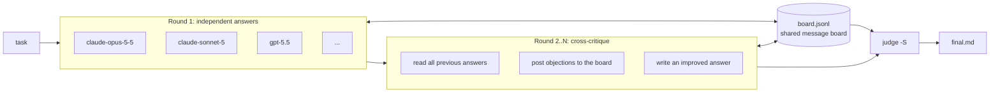

# agent-swarm

**English** | [Русский](README.ru.md)

One command, every model you have: run the same task across Claude Code and OpenAI Codex, let the agents argue on a shared message board, then let a judge write the final answer.

[](https://github.com/gon7187/agent-swarm/actions/workflows/ci.yml)
[](LICENSE)
[](skill/swarm.sh)

`agent-swarm` is a skill plus a single bash script (`swarm.sh`, bash + jq, nothing else). It drives the coding harnesses you already have installed and logged in (`claude -p`, `codex exec`), so there is no API key setup, no server and no daemon. The same `SKILL.md` works in Claude Code (`~/.claude/skills`) and Codex (`~/.agents/skills`).

## How it works



1. **Round 1.** Every model in the roster gets the task and answers independently, in parallel.
2. **Board.** While working, agents read and post to a shared `board.jsonl` (broadcast or `@agent`), so they can split work, share findings and challenge each other.
3. **Rounds 2..N.** Each agent reads all answers from the previous round, critiques them on the board, and produces an improved answer.
4. **Judge.** One model reads the last round plus the board, resolves disagreements on the merits (not by majority vote) and writes `final.md`.

Alternatively, `swarm.sh run tasks.jsonl` gives *different* tasks to *specific* models, all sharing one board, optionally each in its own git worktree.

## Quickstart

```bash
curl -fsSL https://raw.githubusercontent.com/gon7187/agent-swarm/main/install.sh | bash
```

or

```bash
git clone https://github.com/gon7187/agent-swarm && cd agent-swarm && ./install.sh
```

Requirements: bash >= 4, `jq`, `git`, and at least one of `claude` (Claude Code) or `codex` (OpenAI Codex CLI), already authenticated. The installer copies the skill to `~/.agents/skills/swarm`, links it into `~/.claude/skills/swarm`, and prints the roster of models it found.

First run, from your project directory (`swarm` is the `~/.local/bin` link; without it use `~/.agents/skills/swarm/swarm.sh`):

```bash
swarm roster                     # which models are available
swarm all -m "claude-opus-5-5 claude-sonnet-5 gpt-5.5" \
  "Our Postgres job queue deadlocks under load. Find the cause in src/queue/ and propose a fix."
```

```text
.swarm/20260925-143012/
├── task.md
├── board.jsonl                 # everything the agents said to each other
├── r1/
│   ├── claude-opus-5-5.md      # round 1 answers
│   ├── claude-opus-5-5.log
│   ├── claude-opus-5-5.rc
│   ├── claude-sonnet-5.md
│   └── gpt-5.5.md
├── r2/
│   ├── claude-opus-5-5.md      # round 2: after reading and critiquing round 1
│   ├── claude-sonnet-5.md
│   └── gpt-5.5.md
└── final.md                    # the judge's answer
```

### Installer options

| Flag | Effect |
|---|---|
| `--default` | Append a block (between `<!-- swarm:begin -->` / `<!-- swarm:end -->`, idempotent) to `~/.claude/CLAUDE.md` and `~/.codex/AGENTS.md` that makes the swarm the default for multi-part tasks |
| `--prefix DIR` | Install location (default `~/.agents/skills/swarm`) |
| `--no-link` | Do not create `~/.local/bin/swarm` |
| `--uninstall` | Remove the skill, links and the `--default` block |
| `-h` | Help |

## Usage from an agent

The skill tells the agent when to reach for the swarm (2+ independent parts, anything worth a second opinion) and when not to (trivial edits).

**Claude Code**

```text
/swarm review the auth middleware in src/auth for security bugs
```

**Codex**

```text
$swarm review the auth middleware in src/auth for security bugs
```

Or just say "ask all models" / "use the swarm" in plain language; the skill description is written to trigger on that.

## Command reference

| Command | Description |
|---|---|
| `swarm.sh roster` | List models of active harnesses. Claude: `$SWARM_CLAUDE_MODELS` (default `claude-fable-5-1 claude-opus-5-5 claude-sonnet-5 claude-haiku-4-5`). Codex: `$SWARM_CODEX_MODELS` or `codex debug models` (visibility=list) |
| `swarm.sh all [opts] "task"` | Every model answers, `-r` rounds of cross-critique, judge writes `final.md` |
| `swarm.sh run [opts] tasks.jsonl` | Per-agent tasks from JSONL, shared board |
| `swarm.sh post DIR FROM "text" [TO]` | Post to the board (`TO` = agent id, default `all`) |
| `swarm.sh read DIR [ME]` | Print the board (for `ME`: broadcasts, messages to and from `ME`) |
| `swarm.sh status DIR` | Per-agent state (running / done + exit code) and board message count |
| `swarm.sh clean DIR` | Remove the run's worktrees and its `swarm/<run>/*` branches (refuses dirty worktrees and unmerged branches) |
| `swarm.sh version` | Print version |

| Option | Default | Meaning |
|---|---|---|
| `-j N` | `6` | Parallel agents |
| `-t SEC` | `1800` | Timeout per agent |
| `-o DIR` | `.swarm/<timestamp>` | Run directory |
| `-r N` | `2` | Rounds (`all` only) |
| `-m "a b"` | full roster | Model subset |
| `-S MODEL` | first roster model | Judge |
| `-w` | off | Read-write, one git worktree per agent |

| Env var | Purpose |
|---|---|
| `SWARM_CLAUDE_BIN`, `SWARM_CODEX_BIN` | Override the harness binaries (used by the tests to stub them) |
| `SWARM_CLAUDE_MODELS`, `SWARM_CODEX_MODELS` | Override the model lists |
| `SWARM_DEPTH` | Nesting guard, set automatically for workers |

The engine is picked from the model name: `claude-*` runs on Claude Code, everything else on Codex.

## Per-agent tasks (`run`)

One JSON object per line. `id` and `prompt` are required; `model` defaults to the first roster model, `mode` to `ro`.

```jsonl
{"id":"api","model":"gpt-5.5","prompt":"Implement POST /orders in src/api/orders.ts. Own only src/api/.","mode":"rw","worktree":true}
{"id":"ui","model":"claude-sonnet-5","prompt":"Build the order form in web/src/OrderForm.tsx. Own only web/.","mode":"rw","worktree":true}
{"id":"review","model":"claude-opus-5-5","prompt":"Watch the board. Review the API contract api and ui agree on; post mismatches to both.","mode":"ro"}
```

```bash
swarm run -j 3 tasks.jsonl
```

Each `worktree:true` agent gets `.swarm/wt/<run>-<id>` on branch `swarm/<run>/<id>`. Merging those branches is up to you. `dir` sets a custom working directory instead.

## The message board

The board is an append-only JSONL file in the run directory, one message per line:

```json
{"ts":"14:31:07","from":"claude-opus-5-5","to":"all","msg":"The deadlock is lock ordering in claim_job(): rows are locked by priority, not id."}
{"ts":"14:31:40","from":"gpt-5.5","to":"claude-opus-5-5","msg":"Disagree: SKIP LOCKED already avoids that; look at the advisory lock in retry()."}
```

Writes go through `flock`, so parallel agents never interleave lines. Every worker's prompt starts with a preamble that gives it its id and the exact `read` / `post` commands, and asks it to read the board before starting and before finishing. You can watch a run live with `swarm read .swarm/<run>` and even post into it yourself.

## Safety model

| | Read-only (default) | Read-write (`-w`, `"mode":"rw"`) |
|---|---|---|
| Claude Code | `--permission-mode dontAsk`, allowlist: `Read Grep Glob WebSearch WebFetch` + the board's `read`/`post` commands | `--dangerously-skip-permissions` |
| Codex | `workspace-write` sandbox rooted at the run dir: the project is readable, only the board is writable | `workspace-write` on the agent's worktree + the run dir |
| Where it writes | Nothing in your project | Its own git worktree and branch |

- **Default is read-only.** Agents can read your code and the web, and talk on the board. They cannot edit files or run arbitrary commands.
- **Worktrees isolate writers.** With `-w`, each agent works on its own branch in its own worktree, so parallel agents cannot trample each other or your checkout. Nothing is merged automatically. `swarm clean DIR` removes the worktrees and branches once they are merged; dirty worktrees and unmerged branches are left alone.
- **Nesting guard.** Workers run with `SWARM_DEPTH=1` and `swarm.sh` refuses to start inside a worker, so a swarm cannot spawn swarms recursively.
- **rw means rw.** In read-write mode Claude Code runs without permission prompts. Use it in repositories you are willing to let an agent modify, and review the branches before merging.

## Cost

A multi-agent run costs roughly **15x** the tokens of a single agent: full roster x rounds + the judge. Use it where a second opinion is worth money (design decisions, hard bugs, security review), not for one-line fixes. To keep it cheap:

- narrow the roster: `-m "claude-sonnet-5 gpt-5.5"`;
- use one round (`-r 1`) when you only want independent opinions;
- pick a cheaper judge with `-S`.

## Comparison

Honest one-liners; all of these are good tools with different goals.

| Tool | What it is | Difference from agent-swarm |
|---|---|---|
| [Claude Code agent teams](https://docs.claude.com/en/docs/claude-code) | Built-in lead + teammates with a shared task list and messaging | Native and polished, but Claude models only; agent-swarm mixes Claude and Codex models and adds critique rounds + a judge |
| [ruflo / claude-flow](https://github.com/ruvnet/claude-flow) | Large orchestration platform: swarm topologies, memory, many MCP tools | Much bigger surface; agent-swarm is one bash script you can read in five minutes |
| [ccswarm](https://github.com/nwiizo/ccswarm) | Rust orchestrator with role-specialised agents in git worktrees | Similar worktree isolation; agent-swarm focuses on cross-model debate rather than role pipelines |
| [claude-squad](https://github.com/smtg-ai/claude-squad) | TUI to manage several terminal agents in tmux + worktrees | You drive each session by hand; agents do not talk to each other |
| [ccmanager](https://github.com/kbwo/ccmanager) | TUI session manager for coding-agent CLIs across worktrees | Session management, not orchestration or synthesis |
| [uzi](https://github.com/devflowinc/uzi) | CLI to run several agents in parallel worktrees and compare | Parallel attempts, no shared board or judge |
| [oh-my-opencode](https://github.com/code-yeongyu/oh-my-opencode) | opencode plugin with an orchestrator and specialist sub-agents | Lives inside opencode; agent-swarm runs on top of Claude Code and Codex (opencode engine is on the roadmap) |

## FAQ

**Do I need API keys?**
No. `swarm.sh` calls the `claude` and `codex` CLIs you are already logged into and uses their auth and billing.

**Only Claude Code or only Codex installed?**
Works. The roster is built from whichever harnesses are on `PATH`.

**Is the majority vote the answer?**
No. The judge is instructed to decide on the merits and to note where agents disagreed. Still read `final.md` critically; the judge can be wrong.

**Where did my run go?**
`.swarm/<timestamp>/` in the directory you ran it from (add `.swarm/` to `.gitignore`). `swarm status DIR` shows progress.

**An agent hung.**
Each agent is killed after `-t` seconds (default 1800); its `.rc` file holds the exit code (`124` = timeout) and `.log` holds stderr.

**How do I test without burning tokens?**
Point `SWARM_CLAUDE_BIN` / `SWARM_CODEX_BIN` at stub scripts, as `tests/test.sh` does.

## Roadmap

- opencode engine (third harness, more providers).
- MCP server mode: expose `all` / `run` / board as MCP tools so any MCP client can start and watch a swarm.

## More

- [docs/architecture.md](docs/architecture.md): rounds, board format, sandboxing per engine, run layout.
- [docs/recipes.md](docs/recipes.md): architecture review, hard-bug hunt, parallel feature in worktrees, research, second-opinion code review.

## License

[MIT](LICENSE) © 2026 gon7187
