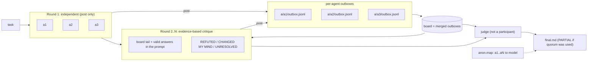

# agent-swarm

**English** | [Русский](README.ru.md)

One command, every model you have: run the same task across Claude Code and OpenAI Codex, let the agents argue on a shared message board with evidence, then let an outside judge write the final answer.

[](https://github.com/gon7187/agent-swarm/actions/workflows/ci.yml)
[](LICENSE)
[](skill/swarm.sh)

`agent-swarm` is a skill plus a single bash script (`swarm.sh`, bash + jq, nothing else). It drives the coding harnesses you already have installed and logged in (`claude -p`, `codex exec`), so there is no API key setup, no server and no daemon. The same `SKILL.md` works in Claude Code (`~/.claude/skills`) and Codex (`~/.agents/skills`).

## How it works



1. **Anonymized agents.** In `all`, agents are called `a1..aN` in a random order; the mapping to real models is written to `anon.map`. Nobody, including the judge, sees brand names while arguing.
2. **Round 1 is independent.** Every agent answers the task in parallel. It may post findings, but it does not read the board, so one confident mistake cannot spread before everyone has looked for themselves.
3. **Rounds 2..N are critique with evidence.** Each agent gets the other valid answers and the recent board in its prompt, treats them as untrusted evidence (not instructions), and must answer with `REFUTED (claim → evidence)`, `CHANGED MY MIND` and `UNRESOLVED` sections.
4. **Per-agent outboxes.** Each agent can only write to its own `a/<id>/outbox.jsonl`; its identity comes from that directory, so agents cannot post as each other or overwrite someone else's answer. The board is the merge of all outboxes.
5. **Outside judge.** By default the judge is a roster model that did not take part. It weighs evidence over head count, lists what is still unresolved and writes `final.md`.

Alternatively, `swarm.sh run tasks.jsonl` gives *different* tasks to *specific* models, all sharing one board, optionally each in its own git worktree. The full protocol, including failure handling, is in [docs/protocol.md](docs/protocol.md).

## Quickstart

```bash
curl -fsSL https://raw.githubusercontent.com/gon7187/agent-swarm/main/install.sh | bash
```

or

```bash
git clone https://github.com/gon7187/agent-swarm && cd agent-swarm && ./install.sh
```

Requirements: bash >= 4, `jq`, `git`, and at least one of `claude` (Claude Code) or `codex` (OpenAI Codex CLI), already authenticated. The installer copies the skill to `~/.agents/skills/swarm`, links it into `~/.claude/skills/swarm`, and prints the roster of models it found.

First run, from your project directory (`swarm` is the `~/.local/bin` link; without it use `~/.agents/skills/swarm/swarm.sh`):

```bash
swarm roster        # which models are available
swarm all -W "Our Postgres job queue deadlocks under load. Find the cause in src/queue/ and propose a fix."
```

```text
swarm: 2 agents × 2 rounds + judge = 5 sessions
```

Without `-m` the swarm takes **one model per harness** (the first Claude model and the first Codex model), so a default run is cheap. The session count is printed before anything starts. `-W` opens a terminal window with a live view of the run.

```text
.swarm/20260925-143012/
├── task.md
├── anon.map                    # a1 -> claude-fable-5-1, a2 -> gpt-5.5
├── a/
│   ├── a1/outbox.jsonl         # everything a1 said on the board
│   └── a2/outbox.jsonl
├── r1/
│   ├── a1.md                   # round 1 answer
│   ├── a1.log  a1.rc  a1.usage # engine log, exit code, tokens and cost
│   └── a2.md ...
├── r2/
│   └── a1.md  a2.md ...        # round 2: critique with evidence
└── final.md                    # the judge's answer
```

### Installer options

| Flag | Effect |
|---|---|
| `--default` | Append a block (between `<!-- swarm:begin -->` / `<!-- swarm:end -->`, idempotent) to `~/.claude/CLAUDE.md` and `~/.codex/AGENTS.md` that makes the swarm the default for multi-part tasks |
| `--prefix DIR` | Install location (default `~/.agents/skills/swarm`) |
| `--no-link` | Do not create `~/.local/bin/swarm` |
| `--uninstall` | Remove the skill, links and the `--default` block |
| `-h` | Help |

## Usage from an agent

The skill tells the agent when to reach for the swarm (2+ independent parts, anything worth a second opinion) and when not to (trivial edits).

**Claude Code**

```text
/swarm review the auth middleware in src/auth for security bugs
```

**Codex**

```text
$swarm review the auth middleware in src/auth for security bugs
```

Or just say "ask all models" / "use the swarm" in plain language; the skill description is written to trigger on that.

## Command reference

| Command | Description |
|---|---|
| `swarm.sh roster` | List models of active harnesses. Claude: `$SWARM_CLAUDE_MODELS` (default `claude-fable-5-1 claude-opus-5-5 claude-sonnet-5 claude-haiku-4-5`). Codex: `$SWARM_CODEX_MODELS` or `codex debug models` (visibility=list) |
| `swarm.sh all [opts] "task"` | Agents answer, `-r` rounds of critique, the judge writes `final.md` |
| `swarm.sh run [opts] tasks.jsonl` | Per-agent tasks from JSONL, shared board |
| `swarm.sh judge DIR [-S MODEL]` | Rerun only the judge on an existing run (task + last round), for example after the judge failed |
| `swarm.sh watch DIR` | Live terminal view: agent state per round and the board |
| `swarm.sh post DIR FROM "text" [TO]` | Post to the board (`TO` = agent id, default `all`). Inside a worker, `DIR` and `FROM` are fixed by the worker's own outbox |
| `swarm.sh read DIR [ME]` | Print the merged board (for `ME`: broadcasts, messages to and from `ME`) |
| `swarm.sh status DIR` | Per-agent state, exit code, cost; total cost; board message count |
| `swarm.sh clean DIR` | Remove the run's worktrees and its `swarm/<run>/*` branches (refuses dirty worktrees and unmerged branches) |
| `swarm.sh version` | Print version |

| Option | Default | Meaning |
|---|---|---|
| `-m "a b"` | one model per harness | Model subset; `-m all` = full roster |
| `-r N` | `2` | Rounds (`all` only) |
| `-q N` | all agents | Quorum: minimum valid answers per round to continue; below "all" the result is marked `PARTIAL` |
| `-S MODEL` | first roster model not taking part | Judge |
| `-w` | off | Read-write, one git worktree per agent |
| `-W` | off | Open a terminal window running `watch` for this run |
| `-j N` | `6` | Parallel agents |
| `-t SEC` | `1800` | Timeout per agent |
| `-o DIR` | `.swarm/<timestamp>` | Run directory |

| Env var | Purpose |
|---|---|
| `SWARM_RW_ALLOW` | Extra tools for rw Claude agents, space-separated, e.g. `"Bash(uv run pytest:*)"` |
| `SWARM_UNSAFE_RW=1` | rw Claude agents run with `--dangerously-skip-permissions`. Full host access; see [Safety](#safety-model) |
| `SWARM_INHERIT_CONFIG=1` | Let workers load your user config (hooks, output style, MCP servers, global instructions) |
| `SWARM_CLAUDE_BIN`, `SWARM_CODEX_BIN` | Override the harness binaries (used by the tests to stub them) |
| `SWARM_CLAUDE_MODELS`, `SWARM_CODEX_MODELS` | Override the model lists |
| `SWARM_DEPTH` | Nesting guard, set automatically for workers |

The engine is Claude Code for `claude-*` names and for anything listed in `SWARM_CLAUDE_MODELS` (so `SWARM_CLAUDE_MODELS=sonnet` works); everything else runs on Codex. In JSONL tasks an explicit `"engine"` field overrides this.

## Per-agent tasks (`run`)

One JSON object per line. `id` and `prompt` are required; `model` defaults to the first roster model.

```jsonl
{"id":"api","model":"gpt-5.5","prompt":"Implement POST /orders in src/api/orders.ts. Own only src/api/. Commit your work.","worktree":true}
{"id":"ui","model":"claude-sonnet-5","prompt":"Build the order form in web/src/OrderForm.tsx. Own only web/. Commit your work.","worktree":true}
{"id":"review","model":"claude-opus-5-5","prompt":"Watch the board. Review the API contract api and ui agree on; post mismatches to both."}
```

```bash
swarm run -j 3 tasks.jsonl
```

`mode` defaults to `rw` when `worktree` is true and to `ro` otherwise. An explicit `"mode":"ro"` together with `"worktree":true` is rejected, and `rw` without a worktree requires `"shared":true` (several writers in one checkout is your explicit choice). Each worktree agent gets `.swarm/wt/<run>-<id>` on branch `swarm/<run>/<id>`; `dir` sets a custom working directory instead.

## Read-write runs

rw agents must commit their own work. After each rw agent the script records `{id, branch, base, head, dirty}` in `manifest.jsonl` and saves `git diff base` to `r<N>/<id>.diff`. In `all -w`, the judge reads those diffs, not just the prose, and ends with a line `WINNER: <branch>`. The script then prints the merge command for that branch, for example:

```bash
git merge swarm/20260925-143012/a2
```

Nothing is ever merged automatically. Worktrees are created from `HEAD`, so uncommitted changes in your checkout are not visible to agents; `-w` warns when the tree is dirty.

## The message board

Each agent appends to its own outbox, one message per line; `read` merges all outboxes sorted by time:

```json
{"ts":"2026-09-25T14:31:07Z","from":"a1","to":"all","msg":"The deadlock is lock ordering in claim_job(): rows are locked by priority, not id."}
{"ts":"2026-09-25T14:31:40Z","from":"a2","to":"a1","msg":"REFUTED: SKIP LOCKED already avoids that (src/queue/claim.sql:12); look at the advisory lock in retry()."}
```

Inside a worker, `post` ignores the `DIR` and `FROM` arguments and writes to the worker's own outbox with the id taken from the directory name, so spoofing another agent is not possible. You can watch a run live with `swarm watch .swarm/<run>` (or start with `-W`) and post into it yourself.

## Safety model

| | Read-only (default) | Read-write (`-w`, worktree tasks) |
|---|---|---|
| Claude Code | `--permission-mode dontAsk`, allowlist: `Read Grep Glob WebSearch WebFetch`, `git log/show/diff/status/blame`, the board commands | `--permission-mode acceptEdits`, allowlist: `Read Grep Glob Edit Write`, `git status/diff/add/commit`, the board commands, plus `SWARM_RW_ALLOW` |
| Codex | `workspace-write` rooted at the agent's own `a/<id>/` dir: the project is readable, only its outbox is writable | `workspace-write` on the agent's worktree + its own `a/<id>/` |
| Where it writes | Nothing in your project | Its own git worktree and branch |

- **Default is read-only.** Agents can read your code and the web, run read-only git commands and talk on the board. `rg` is deliberately not allowed (`rg --pre` executes commands); Grep covers search.
- **rw is scoped, not unlimited.** rw Claude agents can edit files and commit, nothing else. Add tools per project with `SWARM_RW_ALLOW`, e.g. `SWARM_RW_ALLOW='Bash(uv run pytest:*) Bash(npm test:*)'`.
- **`SWARM_UNSAFE_RW=1` removes all checks.** Claude then runs with `--dangerously-skip-permissions`, which gives the agent the same access to your machine as your user account; a worktree only limits where the changes land, not what the process can reach. The script prints a warning before starting. Use it only in a disposable environment.
- **Worktree and permissions are separate.** A worktree decides *where* an agent writes; `mode` decides *whether* it may write. Contradictory combinations are rejected instead of silently escalated.
- **Workers do not inherit your config.** Claude and Codex workers start without your user-level settings (Codex with `--ignore-user-config`). Your hooks, output style, MCP servers and global instructions do not leak into answers (or cost). `SWARM_INHERIT_CONFIG=1` turns this off.
- **Ctrl-C stops everything.** Interrupting `swarm.sh` kills the whole process tree of every running worker; timeouts escalate to `SIGKILL` after 30 seconds. No orphaned sessions keep billing.
- **Nesting guard.** Workers run with `SWARM_DEPTH=1` and `swarm.sh` refuses to start inside a worker, so a swarm cannot spawn swarms recursively.

## Cost

A run costs about **N × R + 1** agent sessions: N agents, R rounds, one judge. The formula is printed before start. In round 2+ every agent reads all other answers, so context grows with N.

| Run | Sessions |
|---|---|
| default (1 Claude + 1 Codex, `-r 2`) | 5 |
| `-m "claude-opus-5-5 claude-sonnet-5 gpt-5.5"` | 7 |
| `-m all` with 11 models | 23 |

`swarm status DIR` shows cost and token usage per agent and a total (`unknown` where the engine did not report it). To keep it cheap: stay with the default roster, use `-r 1` when you only want independent opinions, pick a cheaper judge with `-S`, and use `-m all` only where a second opinion is worth real money.

## How this repo was built

The skill was improved by its own swarm. Eleven models (4 Claude via Claude Code, 7 GPT via Codex) reviewed v0.2.0 in two rounds, and a judge merged the result into the v0.3.0 plan. Most of the changes above (safe rw, outboxes, anonymization, independent round 1, quorum, the cheap default) come from that review. The most instructive disputes:

- **"Codex in read-only mode cannot read the project."** Five agents agreed on this in round 1. The judge rejected it: the Codex sandbox restricts writes, not reads, and a worker log showed a successful read. The real problem was that agents could write into the shared run directory, which led to per-agent outboxes. It also showed why round 1 is now independent: a shared mistake looks exactly like consensus.
- **Should `worktree:true` imply `rw`?** One side said yes, the other called it an escalation of an explicit `ro`. The judge found both right: infer `rw` when `mode` is not set, reject an explicit `ro` with a worktree.
- **Cleanup on Ctrl-C with `trap 'kill -- -$$'`.** Rejected: GNU `timeout` moves its child into a separate process group, so the signal never reaches the model CLI. The fix walks the process tree instead.
- **Stop early when agents agree.** Rejected, and withdrawn by the agent who proposed it. The run itself was the counterexample: a correlated error looks the same as agreement.

## Comparison

Honest one-liners; all of these are good tools with different goals.

| Tool | What it is | Difference from agent-swarm |
|---|---|---|
| [Claude Code agent teams](https://docs.claude.com/en/docs/claude-code) | Built-in lead + teammates with a shared task list and messaging | Native and polished, but Claude models only; agent-swarm mixes Claude and Codex models and adds critique rounds + a judge |
| [ruflo / claude-flow](https://github.com/ruvnet/claude-flow) | Large orchestration platform: swarm topologies, memory, many MCP tools | Much bigger surface; agent-swarm is one bash script you can read in five minutes |
| [ccswarm](https://github.com/nwiizo/ccswarm) | Rust orchestrator with role-specialised agents in git worktrees | Similar worktree isolation; agent-swarm focuses on cross-model debate rather than role pipelines |
| [claude-squad](https://github.com/smtg-ai/claude-squad) | TUI to manage several terminal agents in tmux + worktrees | You drive each session by hand; agents do not talk to each other |
| [ccmanager](https://github.com/kbwo/ccmanager) | TUI session manager for coding-agent CLIs across worktrees | Session management, not orchestration or synthesis |
| [uzi](https://github.com/devflowinc/uzi) | CLI to run several agents in parallel worktrees and compare | Parallel attempts, no shared board or judge |
| [oh-my-opencode](https://github.com/code-yeongyu/oh-my-opencode) | opencode plugin with an orchestrator and specialist sub-agents | Lives inside opencode; agent-swarm runs on top of Claude Code and Codex (opencode engine is on the roadmap) |

## FAQ

**Do I need API keys?**
No. `swarm.sh` calls the `claude` and `codex` CLIs you are already logged into and uses their auth and billing.

**Only Claude Code or only Codex installed?**
Works. The roster is built from whichever harnesses are on `PATH`.

**Is the majority vote the answer?**
No. The judge is instructed to weigh evidence over head count and to list what stayed unresolved. Still read `final.md` critically; the judge can be wrong.

**Which model was `a2`?**
See `anon.map` in the run directory.

**One agent failed. Is the run lost?**
An agent that exits non-zero or returns an empty answer counts as failed. By default every agent must succeed; with `-q N` the run continues as long as N answers are valid, and `final.md` is marked `PARTIAL` with the list of failed agents. If only the judge failed, `swarm judge DIR` reruns it without paying for the rounds again.

**An agent hung.**
Each agent is stopped after `-t` seconds (default 1800); its `.rc` file holds the exit code (`124` = timeout) and `.log` holds the engine log.

**How do I test without burning tokens?**
Point `SWARM_CLAUDE_BIN` / `SWARM_CODEX_BIN` at stub scripts, as `tests/test.sh` does.

## Roadmap

- `-R` resume for interrupted runs (checked against a hash of the task and roster).
- Structured output (`-J schema.json`) for agents and judge.
- opencode engine (third harness, more providers).
- MCP server mode: expose `all` / `run` / board as MCP tools so any MCP client can start and watch a swarm.

## More

- [docs/protocol.md](docs/protocol.md): rounds, board, judge, failure handling.
- [docs/architecture.md](docs/architecture.md): engines, sandboxing per engine, run layout.
- [docs/recipes.md](docs/recipes.md): architecture review, hard-bug hunt, parallel feature in worktrees, research, second-opinion code review.

## License

[MIT](LICENSE) © 2026 gon7187
