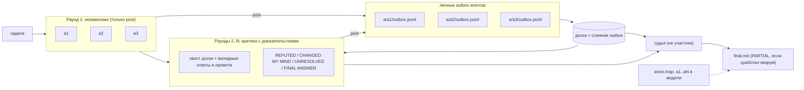

# agent-swarm

[English](README.md) | **Русский**

Одна команда, все ваши модели: одна и та же задача запускается в Claude Code и OpenAI Codex, агенты спорят на общей доске сообщений, опираясь на доказательства, а сторонний судья пишет итоговый ответ.

[](https://github.com/gon7187/agent-swarm/actions/workflows/ci.yml)
[](LICENSE)
[](skill/swarm.sh)

`agent-swarm` — это скилл плюс один bash-скрипт (`swarm.sh`, bash + jq, больше ничего). Он управляет уже установленными и залогиненными агентными CLI (`claude -p`, `codex exec`), поэтому не нужны ни API-ключи, ни сервер, ни демон. Один и тот же `SKILL.md` работает в Claude Code (`~/.claude/skills`) и Codex (`~/.agents/skills`).

## Как это работает



1. **Анонимные агенты.** В `all` агенты получают имена `a1..aN` в случайном порядке; соответствие реальным моделям пишется в `anon.map`. Во время спора никто, включая судью, не видит названий моделей.
2. **Раунд 1 независимый.** Каждый агент отвечает на задачу параллельно с остальными. Писать на доску можно, читать её — нет, чтобы одна уверенная ошибка не разошлась раньше, чем все посмотрели сами.
3. **Раунды 2..N — критика с доказательствами.** Каждый агент получает в промпте чужие валидные ответы и свежий хвост доски, считает их непроверенными данными (а не инструкциями) и обязан ответить секциями `REFUTED (утверждение → доказательство)`, `CHANGED MY MIND` и `UNRESOLVED`, а в конце — полной самостоятельной секцией `FINAL ANSWER`. Ответ без `FINAL ANSWER` считается упавшим и попадает в `PARTIAL`.
4. **Личные outbox.** Каждый агент может писать только в свой `a/<id>/outbox.jsonl`; его имя берётся из этого каталога, поэтому агенты не могут писать от чужого имени или перезаписать чужой ответ. Доска — это слияние всех outbox.
5. **Сторонний судья.** По умолчанию судья — модель из ростера, которая не участвовала в раундах. Он читает ответы последнего раунда, ответы первого раунда как дополнительные доказательства и список упавших агентов по раундам. Он ставит доказательства выше числа голосов, перечисляет нерешённое и пишет `final.md`.

Другой режим: `swarm.sh run tasks.jsonl` раздаёт *разные* задачи *конкретным* моделям с общей доской, при желании — каждой в своём git worktree. Полный протокол, включая обработку сбоев, — в [docs/protocol.md](docs/protocol.md).

## Быстрый старт

```bash
curl -fsSL https://raw.githubusercontent.com/gon7187/agent-swarm/main/install.sh | bash
```

или

```bash
git clone https://github.com/gon7187/agent-swarm && cd agent-swarm && ./install.sh
```

Требования: bash >= 4.3, `jq`, `git` и хотя бы один из `claude` (Claude Code) или `codex` (OpenAI Codex CLI) с выполненным входом. Установщик копирует скилл в `~/.agents/skills/swarm`, линкует его в `~/.claude/skills/swarm` и печатает найденный ростер моделей.

Установщик бережно обращается с существующими файлами. `--prefix` приводится к абсолютному пути и отклоняется, если он пустой, равен `/`, домашнему каталогу или одному из его родителей. Существующий prefix заменяется, только если в нём есть `SKILL.md` и `swarm.sh`; новая копия ставится во временный соседний каталог и затем переносится на место. Блок `--default` в `CLAUDE.md` / `AGENTS.md` переписывается, только если открывающий и закрывающий маркеры идут парами; иначе установщик останавливается с ошибкой и не трогает файл.

Первый запуск из каталога проекта (`swarm` — ссылка в `~/.local/bin`; без неё используйте `~/.agents/skills/swarm/swarm.sh`):

```bash
swarm roster        # какие модели доступны
swarm all -W "Наша очередь задач на Postgres ловит дедлоки под нагрузкой. Найди причину в src/queue/ и предложи фикс."
```

```text
swarm: 2 agents × 2 rounds + judge = 5 sessions
```

Без `-m` рой берёт **по одной модели на харнесс** (первую модель Claude и первую модель Codex), так что запуск по умолчанию дешёвый. Число сессий печатается до старта. `-W` открывает окно терминала с живым просмотром запуска.

```text
.swarm/20260925-143012/
├── task.md
├── anon.map                    # a1 -> claude-fable-5-1, a2 -> gpt-5.5
├── a/
│   ├── a1/outbox.jsonl         # всё, что a1 написал на доску
│   └── a2/outbox.jsonl
├── r1/
│   ├── a1.md                   # ответ раунда 1
│   ├── a1.log  a1.rc  a1.usage # лог движка, код выхода, токены и стоимость
│   └── a2.md ...
├── r2/
│   └── a1.md  a2.md ...        # раунд 2: критика с доказательствами, в конце FINAL ANSWER
├── final.md                    # ответ судьи
└── result.json                 # {rc, final, partial, winner, branches}, пишется в конце
```

### Опции установщика

| Флаг | Что делает |
|---|---|
| `--default` | Дописывает блок (между `<!-- swarm:begin -->` / `<!-- swarm:end -->`, идемпотентно) в `~/.claude/CLAUDE.md` и `~/.codex/AGENTS.md`, делая рой поведением по умолчанию для многосоставных задач |
| `--prefix DIR` | Куда ставить (по умолчанию `~/.agents/skills/swarm`) |
| `--no-link` | Не создавать `~/.local/bin/swarm` |
| `--uninstall` | Удалить скилл, ссылки и блок `--default` |
| `-h` | Справка |

## Вызов из агента

Скилл объясняет агенту, когда звать рой (2+ независимые части, всё, где нужно второе мнение), а когда не надо (тривиальные правки).

**Claude Code**

```text
/swarm review the auth middleware in src/auth for security bugs
```

**Codex**

```text
$swarm review the auth middleware in src/auth for security bugs
```

Или просто скажите обычными словами «спроси все модели» / «запусти рой» — описание скилла написано так, чтобы срабатывать на это.

### Долгие запуски: не на переднем плане

Запуск по умолчанию занимает минуты, большой — до «раунды × `-t`» плюс судья. У Bash-инструмента хоста свой таймаут, и когда он убивает `swarm.sh` на переднем плане, обработчик очистки останавливает и всех воркеров, а оплаченная работа теряется. Изнутри агента используйте один из вариантов:

- **Claude Code:** запускайте команду с `run_in_background`, затем проверяйте `swarm status DIR` или читайте `final.md` / `result.json`, когда запуск закончится.
- **Любой хост, включая Codex:** запускайте отсоединённо с `-d` и ждите короткими отрезками:

```bash
swarm all -d "Review src/auth for security bugs"   # печатает "swarm dir: .swarm/<run>" и сразу возвращается
swarm wait .swarm/<run> -t 300                      # 0 = готово, 75 = ещё идёт, иначе код выхода запуска
```

`-d` запускает оркестратор в отдельной сессии и пишет лог в `<run>/orchestrator.log`. `wait DIR` без `-t` проверяет один раз и сразу возвращается (код 75, пока запуск идёт); `wait DIR -t SEC` ждёт до SEC секунд. Для пакетов `run` поле `final` в `result.json` равно `null`. В конце запуск атомарно записывает `result.json`:

```json
{"rc":0,"final":".swarm/<run>/final.md","partial":false,"winner":"swarm/<run>/a2","branches":["swarm/<run>/a1","swarm/<run>/a2"]}
```

`winner` равен `null` вне rw-запусков или если судья не назвал валидную ветку.

## Справочник команд

| Команда | Описание |
|---|---|
| `swarm.sh roster` | Список моделей активных харнессов. Claude: `$SWARM_CLAUDE_MODELS` (по умолчанию `claude-fable-5-1 claude-opus-5-5 claude-sonnet-5 claude-haiku-4-5`). Codex: `$SWARM_CODEX_MODELS` или `codex debug models` (visibility=list) |
| `swarm.sh all [opts] "task"` | Агенты отвечают, `-r` раундов критики, судья пишет `final.md` |
| `swarm.sh run [opts] tasks.jsonl` | Задачи по агентам из JSONL, общая доска |
| `swarm.sh judge DIR [-S MODEL]` | Перезапустить только судью на существующем запуске (задача + последний раунд), например после его падения |
| `swarm.sh resume DIR` | Продолжить прерванный запуск (v0.4.0): перезапустить только агентов без успешного `.rc`, затем оставшиеся раунды и судью. Отказывается, если изменились задача, `anon.map` или опции |
| `swarm.sh wait DIR [-t SEC]` | Дождаться запуска, обычно стартовавшего с `-d`. Код 0 — готово, 75 — через `SEC` ещё идёт, иначе код выхода запуска |
| `swarm.sh watch DIR` | Живой просмотр в терминале: состояние агентов по раундам и доска |
| `swarm.sh post DIR FROM "text" [TO]` | Написать на доску (`TO` — id агента, по умолчанию `all`). Внутри воркера `DIR` и `FROM` определяются его собственным outbox |
| `swarm.sh read DIR [ME]` | Показать сведённую доску (для `ME`: широковещательные, сообщения к `ME` и от `ME`) |
| `swarm.sh status DIR` | Состояние, код выхода и стоимость по агентам (входные/выходные токены, если движок не сообщает сумму в USD); общая стоимость; число сообщений на доске |
| `swarm.sh clean DIR [--discard BRANCH...]` | Удалить worktree этого запуска и его ветки `swarm/<run>/*`. Грязные worktree и несмёрженные ветки не трогает, кроме веток, явно перечисленных после `--discard` |
| `swarm.sh version` | Показать версию |

| Опция | По умолчанию | Смысл |
|---|---|---|
| `-m "a b"` | по модели на харнесс | Подмножество моделей; `-m all` — весь ростер |
| `-r N` | `2` | Раунды (только `all`) |
| `-q N` | все агенты | Кворум: минимум валидных ответов в раунде, чтобы продолжить; если меньше, чем все, результат помечается `PARTIAL`. Упавшие агенты в следующих раундах не перезапускаются |
| `-S MODEL` | первая модель ростера, не участвующая в раундах | Судья |
| `-w` | выкл. | Чтение-запись, по git worktree на агента |
| `-W` | выкл. | Открыть окно терминала с `watch` для этого запуска |
| `-d` | выкл. | Отсоединиться: запустить в фоне, напечатать `swarm dir: DIR` и вернуться; дальше `wait DIR` |
| `-j N` | `6` | Параллельных агентов |
| `-t SEC` | `1800` | Таймаут на агента |
| `-o DIR` | `.swarm/<timestamp>` | Каталог запуска |

| Переменная | Назначение |
|---|---|
| `SWARM_RW_ALLOW` | Дополнительные инструменты для rw-агентов Claude по одному шаблону на строку, например `$'Bash(uv run pytest:*)\nBash(npm test:*)'` |
| `SWARM_RO_ALLOW` | Дополнительные инструменты для ro-агентов Claude в том же формате, например чтобы ревьюеры могли запустить тесты или воспроизведение |
| `SWARM_UNSAFE_RW=1` | rw-агенты Claude запускаются с `--dangerously-skip-permissions`. Полный доступ к хосту, печатается предупреждение; см. [Модель безопасности](#модель-безопасности) |
| `SWARM_INHERIT_CONFIG=1` | Разрешить воркерам загружать ваш пользовательский конфиг (Claude: пользовательские настройки, хуки, MCP-серверы; Codex: `~/.codex/config.toml`) |
| `SWARM_TERMINAL` | Команда запуска терминала для `-W` (живой просмотр), по умолчанию `xdg-terminal-exec` |
| `SWARM_CLAUDE_BIN`, `SWARM_CODEX_BIN` | Подменить бинарники харнессов (тесты так подсовывают заглушки) |
| `SWARM_CLAUDE_MODELS`, `SWARM_CODEX_MODELS` | Переопределить списки моделей |
| `SWARM_DEPTH` | Защита от вложенности, воркерам выставляется автоматически |

Движок — Claude Code для имён `claude-*` и для всего, что перечислено в `SWARM_CLAUDE_MODELS` (так что `SWARM_CLAUDE_MODELS=sonnet` работает); всё остальное идёт в Codex. В JSONL-задачах это переопределяет явное поле `"engine"`.

## Задачи по агентам (`run`)

Один JSON-объект на строку. `id` и `prompt` обязательны; если `model` не указан, берётся первая модель ростера.

```jsonl
{"id":"api","model":"gpt-5.5","prompt":"Implement POST /orders in src/api/orders.ts. Own only src/api/. Commit your work.","worktree":true}
{"id":"ui","model":"claude-sonnet-5","prompt":"Build the order form in web/src/OrderForm.tsx. Own only web/. Commit your work.","worktree":true}
{"id":"review","model":"claude-opus-5-5","prompt":"Watch the board. Review the API contract api and ui agree on; post mismatches to both."}
```

```bash
swarm run -j 3 tasks.jsonl
```

`mode` по умолчанию `rw`, если `worktree` включён, и `ro` в остальных случаях. Явный `"mode":"ro"` вместе с `"worktree":true` отклоняется, а `rw` без worktree требует `"shared":true` (несколько пишущих агентов в одном checkout — только осознанный выбор). Каждый агент с worktree получает `.swarm/wt/<run>-<id>` на ветке `swarm/<run>/<id>`. Без worktree поле `dir` задаёт рабочий каталог. С `"worktree":true` каталог `dir` внутри репозитория превращается в такой же подкаталог worktree: `"dir":"services/api"` работает в `.swarm/wt/<run>-<id>/services/api`.

## Запуски с записью

rw-агенты Claude сами коммитят свою работу. rw-агенты Codex не могут: их песочница не включает git-каталог репозитория, поэтому за них коммитит оркестратор. После каждого rw-агента скрипт:

1. **Коммитит остатки только при успехе.** Если агент завершился с кодом 0 и оставил незакоммиченные изменения, они коммитятся, но только если `HEAD` всё ещё на ветке, записанной в `worktrees.jsonl`, и по-прежнему происходит от записанной базы. Если git-идентичность не настроена, коммит делается от имени `swarm <swarm@localhost>`. Закоммиченные пути записываются в манифест как `autocommitted`. Изменения упавшего агента никогда не коммитятся.
2. **Падает явно.** Если проверка ветки или коммит не прошли, агент получает `rc=71`, а его файлы остаются как есть, чтобы вы могли их посмотреть. Ветку без её коммита скрипт к слиянию не предлагает.
3. **Записывает результат.** `{id, branch, base, head, dirty}` уходит в `manifest.jsonl`, `git diff base` — в `r<N>/<id>.diff`.

В `all -w` судья читает эти диффы, а не только прозу, и заканчивает строкой `WINNER: <branch>` или `WINNER: NONE`. Скрипт берёт последнюю такую строку и проверяет её: ветка должна принадлежать этому запуску (`worktrees.jsonl`) и не быть грязной. Все ветки выводятся для ревью; для валидного победителя скрипт дополнительно печатает одну команду diff, одну команду слияния и очистку остальных, например:

```bash
git diff <base>..swarm/20260925-143012/a2
git merge -- swarm/20260925-143012/a2
swarm clean .swarm/20260925-143012 --discard swarm/20260925-143012/a1
```

Проигравшие ветки по определению не смёржены, поэтому `clean` удаляет их, только если вы явно назвали их после `--discard`. Автоматически ничего не сливается. Worktree создаются от `HEAD`, поэтому незакоммиченные изменения в вашем checkout агентам не видны; `-w` предупреждает, если дерево грязное.

## Доска сообщений

Каждый агент дописывает в свой outbox, одно сообщение на строку; `read` сводит все outbox, сортируя по времени:

```json
{"ts":"2026-09-25T14:31:07Z","from":"a1","to":"all","msg":"The deadlock is lock ordering in claim_job(): rows are locked by priority, not id."}
{"ts":"2026-09-25T14:31:40Z","from":"a2","to":"a1","msg":"REFUTED: SKIP LOCKED already avoids that (src/queue/claim.sql:12); look at the advisory lock in retry()."}
```

Внутри воркера `post` игнорирует аргументы `DIR` и `FROM` и пишет в собственный outbox воркера с именем, взятым из каталога, так что выдать себя за другого агента нельзя. За запуском можно следить вживую через `swarm watch .swarm/<run>` (или стартовать с `-W`) и писать туда самому.

## Модель безопасности

| | Только чтение (по умолчанию) | Чтение-запись (`-w`, задачи с worktree) |
|---|---|---|
| Claude Code | `--permission-mode dontAsk`, allowlist: `Read Grep Glob WebSearch WebFetch`, `git log/show/diff/status/blame`, команды доски, плюс `SWARM_RO_ALLOW` | `--permission-mode acceptEdits`, allowlist: `Read Grep Glob Edit Write`, `git status/diff/add/commit`, команды доски, плюс `SWARM_RW_ALLOW` |
| Codex | `workspace-write` с корнем в собственном каталоге агента `a/<id>/`: проект доступен на чтение, писать можно только в свой outbox | `workspace-write` на worktree агента + его `a/<id>/`; доступа к git-каталогу нет, коммитит оркестратор |
| Куда пишет | Ничего в вашем проекте | Свой git worktree и своя ветка |

- **По умолчанию — только чтение.** Агенты читают ваш код и веб, выполняют читающие git-команды и общаются на доске. `rg` намеренно не разрешён (`rg --pre` исполняет команды); для поиска есть Grep. Чтобы ro-агенты Claude могли запускать тесты или воспроизведение, разрешите эти команды через `SWARM_RO_ALLOW`.
- **rw ограничен, а не безграничен.** rw-агенты Claude могут править файлы и коммитить, больше ничего. Инструменты для конкретного проекта добавляются через `SWARM_RW_ALLOW`, например `SWARM_RW_ALLOW=$'Bash(uv run pytest:*)\nBash(npm test:*)'`.
- **`SWARM_UNSAFE_RW=1` снимает все проверки.** Тогда Claude запускается с `--dangerously-skip-permissions`, и агент получает тот же доступ к машине, что и ваша учётная запись; worktree ограничивает только место, куда попадут изменения, а не то, до чего дотянется процесс. Перед стартом скрипт печатает предупреждение в stderr. Используйте это только в одноразовом окружении.
- **rw Codex не имеет доступа к git-каталогу.** Раньше rw-воркеры Codex получали `--add-dir` на git-каталог репозитория, чтобы коммитить, а это могло открыть на запись из песочницы и `.git/hooks` с `.git/config`. Этот доступ убран; за Codex коммитит оркестратор.
- **Worktree и права — разные вещи.** Worktree определяет, *где* агент пишет; `mode` — *может ли* он писать. Противоречивые сочетания отклоняются, а не молча повышают права.
- **Воркеры следуют конфигу проекта, а не вашему пользовательскому.** Воркеры Claude загружают только проектные и локальные настройки (`--setting-sources project,local`) и никаких MCP-серверов (`--strict-mcp-config`): проектный `CLAUDE.md` действует, а ваши пользовательские хуки, стиль вывода и MCP-серверы — нет. Воркеры Codex запускаются с `--ignore-user-config`, который пропускает только `~/.codex/config.toml`; например, файлы `AGENTS.md` Codex читает как обычно. `SWARM_INHERIT_CONFIG=1` отключает эту изоляцию.
- **Ctrl-C останавливает всё.** Прерывание `swarm.sh` убивает всё дерево процессов каждого работающего воркера; таймауты через 30 секунд доходят до `SIGKILL`. Брошенные сессии не продолжают тратить деньги.
- **Защита от вложенности.** Воркеры работают с `SWARM_DEPTH=1`, и `swarm.sh` отказывается стартовать внутри воркера, так что рой не может рекурсивно порождать рои.

## Стоимость

Запуск стоит примерно **N × R + 1** агентских сессий: N агентов, R раундов, один судья. Формула печатается до старта. Начиная со второго раунда каждый агент читает все чужие ответы, так что контекст растёт вместе с N.

| Запуск | Сессий |
|---|---|
| по умолчанию (1 Claude + 1 Codex, `-r 2`) | 5 |
| `-m "claude-opus-5-5 claude-sonnet-5 gpt-5.5"` | 7 |
| `-m all` с 11 моделями | 23 |

`swarm status DIR` показывает стоимость по агентам и итог. Codex не сообщает сумму в USD, поэтому для агентов Codex вместо неё показываются входные/выходные токены; `unknown` значит, что движок ничего не сообщил. Чтобы было дешевле: оставайтесь на ростере по умолчанию, берите `-r 1`, если нужны только независимые мнения, выбирайте судью подешевле через `-S`, а `-m all` используйте только там, где второе мнение стоит реальных денег.

## Как собран этот репозиторий

Скилл улучшали его же роем. Одиннадцать моделей (4 Claude через Claude Code, 7 GPT через Codex) в два раунда отревьюили v0.2.0, а судья свёл результат в план v0.3.0. Большая часть изменений выше (безопасный rw, outbox, анонимизация, независимый первый раунд, кворум, дешёвый дефолт) пришла из этого ревью. Самые показательные споры:

- **«Codex в режиме только чтения не может читать проект».** В первом раунде с этим согласились пять агентов. Судья отклонил: песочница Codex ограничивает запись, а не чтение, и лог одного из воркеров показывал успешное чтение. Настоящая проблема была в том, что агенты могли писать в общий каталог запуска, — отсюда личные outbox. Заодно стало видно, зачем первый раунд теперь независимый: общая ошибка выглядит в точности как консенсус.
- **Должен ли `worktree:true` означать `rw`?** Одна сторона говорила «да», другая называла это повышением прав поверх явного `ro`. Судья признал правыми обе: выводить `rw`, если `mode` не задан, и отклонять явный `ro` вместе с worktree.
- **Очистка по Ctrl-C через `trap 'kill -- -$$'`.** Отклонено: GNU `timeout` переводит дочерний процесс в отдельную группу, и сигнал до CLI модели не доходит. Фикс вместо этого обходит дерево процессов.
- **Останавливаться досрочно, когда агенты согласны.** Отклонено, и автор предложения сам его отозвал. Этот же прогон стал контрпримером: коррелированная ошибка выглядит так же, как согласие.

Во второй итерации то же упражнение повторили на v0.3.0: ещё одно ревью одиннадцатью моделями, вердикт которого стал планом v0.4.0. На этот раз агенты подкрепляли утверждения воспроизведениями на заглушках (поддельные бинарники `claude` / `codex`, как в `tests/test.sh`) и нашли настоящие регрессии: автокоммит в rw коммитил и работу упавших воркеров, причём на ту ветку, на которой в этот момент оказался `HEAD`; `--safe-mode` незаметно скрывал от воркеров проектный `CLAUDE.md`; обещанное документацией предупреждение `SWARM_UNSAFE_RW` не печаталось; у `--prefix` в установщике не было защиты от удаления произвольного каталога. Одно утверждение уровня P0 было опровергнуто: «судья и раунды критики не видят ответов, потому что получают только пути к файлам». Судья, сам получивший только пути, проверил это напрямую и прочитал файлы ответов через `--add-dir`.

## Сравнение

Честно и в одну строку; все эти инструменты хороши, просто у них другие цели.

| Инструмент | Что это | Отличие от agent-swarm |
|---|---|---|
| [Claude Code agent teams](https://docs.claude.com/en/docs/claude-code) | Встроенные лид + тиммейты с общим списком задач и перепиской | Нативно и отполировано, но только модели Claude; agent-swarm смешивает модели Claude и Codex и добавляет раунды критики и судью |
| [ruflo / claude-flow](https://github.com/ruvnet/claude-flow) | Большая оркестрационная платформа: топологии роя, память, множество MCP-инструментов | Гораздо шире по охвату; agent-swarm — один bash-скрипт, который читается за пять минут |
| [ccswarm](https://github.com/nwiizo/ccswarm) | Оркестратор на Rust с агентами по ролям в git worktree | Похожая изоляция через worktree; agent-swarm делает упор на межмодельные дебаты, а не на ролевые конвейеры |
| [claude-squad](https://github.com/smtg-ai/claude-squad) | TUI для управления несколькими терминальными агентами в tmux + worktree | Каждой сессией рулите вы сами; агенты друг с другом не общаются |
| [ccmanager](https://github.com/kbwo/ccmanager) | TUI-менеджер сессий агентных CLI по worktree | Управление сессиями, а не оркестрация и синтез |
| [uzi](https://github.com/devflowinc/uzi) | CLI для параллельного запуска нескольких агентов в worktree и сравнения | Параллельные попытки, без общей доски и судьи |
| [oh-my-opencode](https://github.com/code-yeongyu/oh-my-opencode) | Плагин opencode с оркестратором и специализированными субагентами | Живёт внутри opencode; agent-swarm работает поверх Claude Code и Codex (движок opencode — в роадмапе) |

## FAQ

**Нужны ли API-ключи?**
Нет. `swarm.sh` вызывает CLI `claude` и `codex`, в которые вы уже вошли, и использует их авторизацию и биллинг.

**Установлен только Claude Code или только Codex?**
Работает. Ростер собирается из тех харнессов, что есть в `PATH`.

**Ответ — это голос большинства?**
Нет. Судье велено ставить доказательства выше числа голосов и перечислять то, что осталось нерешённым. И всё равно читайте `final.md` критически: судья тоже может ошибаться.

**Какой моделью был `a2`?**
Смотрите `anon.map` в каталоге запуска.

**Один агент упал. Запуск потерян?**
Агент, который завершился с ненулевым кодом или вернул пустой ответ, считается упавшим; так же считается ответ раунда 2+ без секции `FINAL ANSWER`. По умолчанию успешно должны отработать все; с `-q N` запуск продолжается, пока валидных ответов не меньше N, а `final.md` помечается `PARTIAL` со списком упавших агентов. Упавший агент в следующих раундах не перезапускается, а судья получает журнал того, кто и в каком раунде упал. Если упал только судья, `swarm judge DIR` перезапустит его, не оплачивая раунды заново; если запуск прервался, `swarm resume DIR` продолжит его и перезапустит только незавершённых агентов.

**Агент завис.**
Каждый агент останавливается через `-t` секунд (по умолчанию 1800); в его файле `.rc` — код выхода (`124` = таймаут, `71` = не прошли проверка ветки или коммит в rw), в `.log` — лог движка.

**Как тестировать, не сжигая токены?**
Направьте `SWARM_CLAUDE_BIN` / `SWARM_CODEX_BIN` на скрипты-заглушки, как это делает `tests/test.sh`.

## Роадмап

- Структурированный вывод (`-J schema.json`) для агентов и судьи.
- Движок opencode (третий харнесс, больше провайдеров), когда движки окажутся за единым адаптером с тестами на заглушках.
- Необязательный однораундовый базовый прогон, чтобы измерить, действительно ли раунды критики улучшают ответы.

Сознательно не планируется: автоматическое слияние `WINNER`, досрочная остановка при согласии, встроенная таблица цен в USD, а также MCP-сервер или демон (`-d` + `wait` покрывают управление запуском из другого агента).

## Подробнее

- [docs/protocol.md](docs/protocol.md): раунды, доска, судья, обработка сбоев.
- [docs/architecture.md](docs/architecture.md): движки, песочницы по движкам, раскладка файлов запуска.
- [docs/recipes.md](docs/recipes.md): ревью архитектуры, охота на тяжёлый баг, параллельная фича в worktree, ресёрч, второе мнение на код-ревью.

## Лицензия

[MIT](LICENSE) © 2026 gon7187
