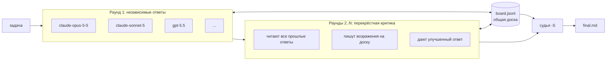

# agent-swarm

[English](README.md) | **Русский**

Одна команда, все ваши модели: одна и та же задача запускается в Claude Code и OpenAI Codex, агенты спорят на общей доске сообщений, а судья пишет итоговый ответ.

[](https://github.com/gon7187/agent-swarm/actions/workflows/ci.yml)
[](LICENSE)
[](skill/swarm.sh)

`agent-swarm` — это скилл плюс один bash-скрипт (`swarm.sh`, bash + jq, больше ничего). Он управляет уже установленными и залогиненными агентными CLI (`claude -p`, `codex exec`), поэтому не нужны ни API-ключи, ни сервер, ни демон. Один и тот же `SKILL.md` работает в Claude Code (`~/.claude/skills`) и Codex (`~/.agents/skills`).

## Как это работает



1. **Раунд 1.** Каждая модель из ростера получает задачу и отвечает независимо, параллельно с остальными.
2. **Доска.** По ходу работы агенты читают общий `board.jsonl` и пишут в него (всем или `@агенту`): делят работу, делятся находками, оспаривают друг друга.
3. **Раунды 2..N.** Каждый агент читает все ответы предыдущего раунда, критикует их на доске и выдаёт улучшенный ответ.
4. **Судья.** Одна модель читает последний раунд и доску, разрешает разногласия по существу (а не голосованием большинства) и пишет `final.md`.

Другой режим: `swarm.sh run tasks.jsonl` раздаёт *разные* задачи *конкретным* моделям с общей доской, при желании — каждой в своём git worktree.

## Быстрый старт

```bash
curl -fsSL https://raw.githubusercontent.com/gon7187/agent-swarm/main/install.sh | bash
```

или

```bash
git clone https://github.com/gon7187/agent-swarm && cd agent-swarm && ./install.sh
```

Требования: bash >= 4, `jq`, `git` и хотя бы один из `claude` (Claude Code) или `codex` (OpenAI Codex CLI) с выполненным входом. Установщик копирует скилл в `~/.agents/skills/swarm`, линкует его в `~/.claude/skills/swarm` и печатает найденный ростер моделей.

Первый запуск из каталога проекта (`swarm` — ссылка в `~/.local/bin`; без неё используйте `~/.agents/skills/swarm/swarm.sh`):

```bash
swarm roster                     # какие модели доступны
swarm all -m "claude-opus-5-5 claude-sonnet-5 gpt-5.5" \
  "Наша очередь задач на Postgres ловит дедлоки под нагрузкой. Найди причину в src/queue/ и предложи фикс."
```

```text
.swarm/20260925-143012/
├── task.md
├── board.jsonl                 # всё, что агенты сказали друг другу
├── r1/
│   ├── claude-opus-5-5.md      # ответы раунда 1
│   ├── claude-opus-5-5.log
│   ├── claude-opus-5-5.rc
│   ├── claude-sonnet-5.md
│   └── gpt-5.5.md
├── r2/
│   ├── claude-opus-5-5.md      # раунд 2: после чтения и критики раунда 1
│   ├── claude-sonnet-5.md
│   └── gpt-5.5.md
└── final.md                    # ответ судьи
```

### Опции установщика

| Флаг | Что делает |
|---|---|
| `--default` | Дописывает блок (между `<!-- swarm:begin -->` / `<!-- swarm:end -->`, идемпотентно) в `~/.claude/CLAUDE.md` и `~/.codex/AGENTS.md`, делая рой поведением по умолчанию для многосоставных задач |
| `--prefix DIR` | Куда ставить (по умолчанию `~/.agents/skills/swarm`) |
| `--no-link` | Не создавать `~/.local/bin/swarm` |
| `--uninstall` | Удалить скилл, ссылки и блок `--default` |
| `-h` | Справка |

## Вызов из агента

Скилл объясняет агенту, когда звать рой (2+ независимые части, всё, где нужно второе мнение), а когда не надо (тривиальные правки).

**Claude Code**

```text
/swarm review the auth middleware in src/auth for security bugs
```

**Codex**

```text
$swarm review the auth middleware in src/auth for security bugs
```

Или просто скажите обычными словами «спроси все модели» / «запусти рой» — описание скилла написано так, чтобы срабатывать на это.

## Справочник команд

| Команда | Описание |
|---|---|
| `swarm.sh roster` | Список моделей активных харнессов. Claude: `$SWARM_CLAUDE_MODELS` (по умолчанию `claude-fable-5-1 claude-opus-5-5 claude-sonnet-5 claude-haiku-4-5`). Codex: `$SWARM_CODEX_MODELS` или `codex debug models` (visibility=list) |
| `swarm.sh all [opts] "task"` | Отвечают все модели, `-r` раундов перекрёстной критики, судья пишет `final.md` |
| `swarm.sh run [opts] tasks.jsonl` | Задачи по агентам из JSONL, общая доска |
| `swarm.sh post DIR FROM "text" [TO]` | Написать на доску (`TO` — id агента, по умолчанию `all`) |
| `swarm.sh read DIR [ME]` | Показать доску (для `ME`: широковещательные, сообщения к `ME` и от `ME`) |
| `swarm.sh status DIR` | Состояние по агентам (running / done + код выхода) и число сообщений на доске |
| `swarm.sh clean DIR` | Удалить worktree этого запуска и его ветки `swarm/<run>/*` (грязные worktree и несмёрженные ветки не трогает) |
| `swarm.sh version` | Показать версию |

| Опция | По умолчанию | Смысл |
|---|---|---|
| `-j N` | `6` | Параллельных агентов |
| `-t SEC` | `1800` | Таймаут на агента |
| `-o DIR` | `.swarm/<timestamp>` | Каталог запуска |
| `-r N` | `2` | Раунды (только `all`) |
| `-m "a b"` | весь ростер | Подмножество моделей |
| `-S MODEL` | первая модель ростера | Судья |
| `-w` | выкл. | Чтение-запись, по git worktree на агента |

| Переменная | Назначение |
|---|---|
| `SWARM_CLAUDE_BIN`, `SWARM_CODEX_BIN` | Подменить бинарники харнессов (тесты так подсовывают заглушки) |
| `SWARM_CLAUDE_MODELS`, `SWARM_CODEX_MODELS` | Переопределить списки моделей |
| `SWARM_DEPTH` | Защита от вложенности, воркерам выставляется автоматически |

Движок выбирается по имени модели: `claude-*` идёт в Claude Code, всё остальное — в Codex.

## Задачи по агентам (`run`)

Один JSON-объект на строку. `id` и `prompt` обязательны; `model` по умолчанию — первая модель ростера, `mode` — `ro`.

```jsonl
{"id":"api","model":"gpt-5.5","prompt":"Implement POST /orders in src/api/orders.ts. Own only src/api/.","mode":"rw","worktree":true}
{"id":"ui","model":"claude-sonnet-5","prompt":"Build the order form in web/src/OrderForm.tsx. Own only web/.","mode":"rw","worktree":true}
{"id":"review","model":"claude-opus-5-5","prompt":"Watch the board. Review the API contract api and ui agree on; post mismatches to both.","mode":"ro"}
```

```bash
swarm run -j 3 tasks.jsonl
```

Каждый агент с `worktree:true` получает `.swarm/wt/<run>-<id>` на ветке `swarm/<run>/<id>`. Сливать эти ветки — ваша работа. Поле `dir` вместо этого задаёт произвольный рабочий каталог.

## Доска сообщений

Доска — это дописываемый JSONL-файл в каталоге запуска, одно сообщение на строку:

```json
{"ts":"14:31:07","from":"claude-opus-5-5","to":"all","msg":"The deadlock is lock ordering in claim_job(): rows are locked by priority, not id."}
{"ts":"14:31:40","from":"gpt-5.5","to":"claude-opus-5-5","msg":"Disagree: SKIP LOCKED already avoids that; look at the advisory lock in retry()."}
```

Запись идёт через `flock`, поэтому параллельные агенты никогда не перемешивают строки. Промпт каждого воркера начинается с преамбулы, которая сообщает ему его id и точные команды `read` / `post` и просит читать доску перед началом и перед завершением. За запуском можно следить вживую через `swarm read .swarm/<run>` и даже писать туда самому.

## Модель безопасности

| | Только чтение (по умолчанию) | Чтение-запись (`-w`, `"mode":"rw"`) |
|---|---|---|
| Claude Code | `--permission-mode dontAsk`, allowlist: `Read Grep Glob WebSearch WebFetch` + команды доски `read`/`post` | `--dangerously-skip-permissions` |
| Codex | песочница `workspace-write` с корнем в каталоге запуска: проект доступен на чтение, писать можно только в доску | `workspace-write` на worktree агента + каталог запуска |
| Куда пишет | Ничего в вашем проекте | Свой git worktree и своя ветка |

- **По умолчанию — только чтение.** Агенты читают ваш код и веб и общаются на доске. Редактировать файлы и запускать произвольные команды они не могут.
- **Worktree изолируют пишущих.** С `-w` каждый агент работает в своей ветке и своём worktree, поэтому параллельные агенты не топчут друг друга и ваш checkout. Автоматически ничего не сливается. `swarm clean DIR` удаляет worktree и ветки после слияния; грязные worktree и несмёрженные ветки остаются нетронутыми.
- **Защита от вложенности.** Воркеры работают с `SWARM_DEPTH=1`, и `swarm.sh` отказывается стартовать внутри воркера, так что рой не может рекурсивно порождать рои.
- **rw — значит rw.** В режиме чтения-записи Claude Code работает без запросов разрешений. Используйте его в репозиториях, которые готовы доверить агенту, и просматривайте ветки перед слиянием.

## Стоимость

Многоагентный запуск стоит примерно в **15 раз** больше токенов, чем один агент: весь ростер x раунды + судья. Применяйте там, где второе мнение стоит денег (архитектурные решения, тяжёлые баги, security-ревью), а не для однострочных фиксов. Чтобы было дешевле:

- сузьте ростер: `-m "claude-sonnet-5 gpt-5.5"`;
- один раунд (`-r 1`), если нужны только независимые мнения;
- выберите судью подешевле через `-S`.

## Сравнение

Честно и в одну строку; все эти инструменты хороши, просто у них другие цели.

| Инструмент | Что это | Отличие от agent-swarm |
|---|---|---|
| [Claude Code agent teams](https://docs.claude.com/en/docs/claude-code) | Встроенные лид + тиммейты с общим списком задач и перепиской | Нативно и отполировано, но только модели Claude; agent-swarm смешивает модели Claude и Codex и добавляет раунды критики и судью |
| [ruflo / claude-flow](https://github.com/ruvnet/claude-flow) | Большая оркестрационная платформа: топологии роя, память, множество MCP-инструментов | Гораздо шире по охвату; agent-swarm — один bash-скрипт, который читается за пять минут |
| [ccswarm](https://github.com/nwiizo/ccswarm) | Оркестратор на Rust с агентами по ролям в git worktree | Похожая изоляция через worktree; agent-swarm делает упор на межмодельные дебаты, а не на ролевые конвейеры |
| [claude-squad](https://github.com/smtg-ai/claude-squad) | TUI для управления несколькими терминальными агентами в tmux + worktree | Каждой сессией рулите вы сами; агенты друг с другом не общаются |
| [ccmanager](https://github.com/kbwo/ccmanager) | TUI-менеджер сессий агентных CLI по worktree | Управление сессиями, а не оркестрация и синтез |
| [uzi](https://github.com/devflowinc/uzi) | CLI для параллельного запуска нескольких агентов в worktree и сравнения | Параллельные попытки, без общей доски и судьи |
| [oh-my-opencode](https://github.com/code-yeongyu/oh-my-opencode) | Плагин opencode с оркестратором и специализированными субагентами | Живёт внутри opencode; agent-swarm работает поверх Claude Code и Codex (движок opencode — в роадмапе) |

## FAQ

**Нужны ли API-ключи?**
Нет. `swarm.sh` вызывает CLI `claude` и `codex`, в которые вы уже вошли, и использует их авторизацию и биллинг.

**Установлен только Claude Code или только Codex?**
Работает. Ростер собирается из тех харнессов, что есть в `PATH`.

**Ответ — это голос большинства?**
Нет. Судье велено решать по существу и отмечать, где агенты разошлись. И всё равно читайте `final.md` критически: судья тоже может ошибаться.

**Куда делся мой запуск?**
В `.swarm/<timestamp>/` в каталоге, откуда вы запускали (добавьте `.swarm/` в `.gitignore`). Прогресс показывает `swarm status DIR`.

**Агент завис.**
Каждый агент убивается через `-t` секунд (по умолчанию 1800); в его файле `.rc` — код выхода (`124` = таймаут), в `.log` — stderr.

**Как тестировать, не сжигая токены?**
Направьте `SWARM_CLAUDE_BIN` / `SWARM_CODEX_BIN` на скрипты-заглушки, как это делает `tests/test.sh`.

## Роадмап

- Движок opencode (третий харнесс, больше провайдеров).
- Режим MCP-сервера: `all` / `run` / доска как MCP-инструменты, чтобы любой MCP-клиент мог запускать рой и следить за ним.

## Подробнее

- [docs/architecture.md](docs/architecture.md): раунды, формат доски, песочницы по движкам, раскладка файлов запуска.
- [docs/recipes.md](docs/recipes.md): ревью архитектуры, охота на тяжёлый баг, параллельная фича в worktree, ресёрч, второе мнение на код-ревью.

## Лицензия

[MIT](LICENSE) © 2026 gon7187
