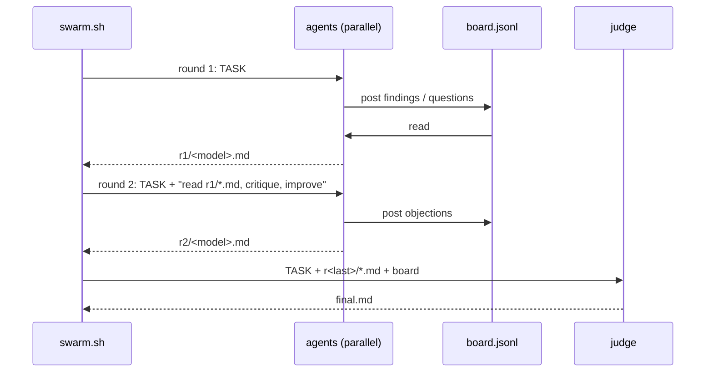

# Architecture

`swarm.sh` is a single bash script. It does not host models, keep state in a server or talk to APIs directly: it launches the coding-agent CLIs you already use (`claude -p`, `codex exec`) as child processes, gives each one a prompt and a working directory, and collects their output into files.

## Engines

The engine is chosen from the model name:

| Model name | Engine | Command (simplified) |
|---|---|---|
| `claude-*` | Claude Code | `claude -p "<prompt>" --model <model> ...` |
| anything else | Codex | `codex exec --skip-git-repo-check -m <model> -o <out.md> -s workspace-write ... "<prompt>"` |

Binaries can be replaced with `SWARM_CLAUDE_BIN` / `SWARM_CODEX_BIN`, which is how `tests/test.sh` runs the whole flow offline against stubs.

The roster (`swarm.sh roster`) is the union of:

- Claude models from `$SWARM_CLAUDE_MODELS` (default `claude-fable-5-1 claude-opus-5-5 claude-sonnet-5 claude-haiku-4-5`), if `claude` is on `PATH`;
- Codex models from `$SWARM_CODEX_MODELS`, or from `codex debug models` filtered to `visibility == "list"`, if `codex` is on `PATH`.

## The `all` flow



1. `task.md` is written to the run directory.
2. **Round 1.** For every model in the roster (or `-m`), one agent is started with the task. At most `-j` agents run at the same time; each is killed after `-t` seconds.
3. **Round r > 1.** Every agent gets the same task plus an instruction: the previous round's answers are in `r<r-1>/*.md`; read them, critique them, post errors to the board, adopt what is right and give an improved answer. Agents in a round run in parallel; rounds are sequential.
4. **Judge.** The `-S` model (default: first roster model) runs read-only with the task, the last round's answers and the board. It is told to resolve disagreements on the merits rather than by majority, and to note where agents disagreed and why. Its answer is `final.md`.

Every agent's prompt is prefixed with a preamble:

```text
You are agent "<id>" in a swarm of AI agents working in parallel. Project dir: <project>
Shared message board (use it to coordinate, share findings, challenge others, avoid duplicate work):
  read:  <swarm.sh> read <run> <id>
  post:  <swarm.sh> post <run> <id> "message" [target_agent_id]
Read the board before starting and before finishing; post key findings and disagreements briefly.
You are a worker: never start another swarm or spawn sub-agents. Your final message is your deliverable.
```

In `all` the agent id is the model name; in `run` it is the task `id`; the judge is `synth`.

## The `run` flow

`tasks.jsonl` holds one task per line:

| Field | Required | Default | Meaning |
|---|---|---|---|
| `id` | yes | | Agent id, output file name, branch suffix |
| `prompt` | yes | | The task |
| `model` | no | first roster model | Model (and therefore engine) |
| `mode` | no | `ro` | `ro` or `rw` |
| `worktree` | no | `false` | Create a git worktree for this agent |
| `dir` | no | project dir | Working directory (ignored if `worktree` is true) |

Lines without `id` and `prompt` are skipped. All tasks start in parallel (up to `-j`), share one board, and write `<run>/<id>.md`. There are no rounds and no judge: coordination happens on the board.

## Board format

`<run>/board.jsonl`, append-only, one JSON object per line:

```json
{"ts":"14:31:07","from":"claude-opus-5-5","to":"all","msg":"..."}
```

| Field | Meaning |
|---|---|
| `ts` | Local time `HH:MM:SS` |
| `from` | Sender id |
| `to` | Recipient id, or `all` for a broadcast |
| `msg` | Text |

- `post` builds the object with `jq -n` (so any text is safely escaped) and appends it under `flock <run>/board.lock`: concurrent writers never interleave.
- `read DIR ME` shows broadcasts, messages to `ME` and messages from `ME`; `read DIR` shows everything.
- The board is a plain file: you can `tail -f` it, grep it, or post into a running swarm yourself.

## Sandboxing per engine

| | Claude Code | Codex |
|---|---|---|
| **ro** (default) | `--permission-mode dontAsk` with `--allowedTools Read Grep Glob WebSearch WebFetch "Bash(<swarm.sh> read:*)" "Bash(<swarm.sh> post:*)"`. Anything not on the list is denied without a prompt. Working dir: the project. | `-s workspace-write -C <run>`: the sandbox's writable root is the run dir, so the agent can write the board and its output; the project is read-only to it. |
| **rw** (`-w` or `"mode":"rw"`) | `--dangerously-skip-permissions`, working dir = the agent's worktree (or `dir`). | `-s workspace-write -C <worktree> --add-dir <run>`: writable worktree plus the run dir for the board. |
| **judge** | Always ro. | Always ro. |

All agents run with stdin closed (`</dev/null`) and under `timeout`.

### Worktrees

With `-w` (all) or `"worktree":true` (run), each agent gets:

- path `<repo>/.swarm/wt/<run>-<id>`,
- branch `swarm/<run>/<id>`, created from the current `HEAD`.

Worktrees need a git repository. They are never merged automatically; inspect and merge the branches yourself, then `swarm.sh clean <run>` removes the worktrees and the `swarm/<run>/*` branches. `clean` is conservative: it refuses to delete a worktree with uncommitted changes or a branch that is not merged, so agent work is never lost by accident.

### Nesting guard

`swarm.sh` exports `SWARM_DEPTH=1` before launching agents and refuses to start a swarm when `SWARM_DEPTH >= 1`. A worker that tries to start its own swarm gets an error telling it to do the task itself. The board subcommands (`read`, `post`) and `roster` still work inside workers.

## File layout of a run

```text
<run>/                         # -o, default .swarm/<YYYYmmdd-HHMMSS>
├── task.md                    # all: the task text
├── board.jsonl                # messages
├── board.lock                 # flock target
├── r1/                        # all: one dir per round
│   ├── <model>.md             # the agent's final message
│   ├── <model>.log            # stderr / engine log
│   └── <model>.rc             # exit code (124 = timeout)
├── r2/ ...
├── final.md                   # all: judge output (+ final.log, final.rc)
└── <id>.md / .log / .rc       # run: one set per task
```

When a phase finishes, `swarm.sh` prints a summary table (agent, exit code, output path) and the board message count. `swarm.sh status <run>` shows the same for a run in progress.
