# Benchmark: solo model vs swarm — landing page

One creative, open-ended frontend task, three contestants, same brief, same start time.

- **A** — `gpt-6-astra` solo (`swarm.sh run`, one task)
- **B** — `claude-opus-5-5` solo (`swarm.sh run`, one task)
- **C** — swarm: `swarm.sh all -w -m "claude-opus-5-5 gpt-6-astra claude-sonnet-5 gpt-6-sol" -S claude-fable-5-1` (4 workers × 2 rounds + judge)

Date: 2026-09-26. Swarm version 0.5.1. Task: [BRIEF.md](BRIEF.md) — a selling English landing page for a fictional
handheld wet-and-dry vacuum with images, a real interactive 3D scene, rich animations and an unusual custom cursor.
All runs started at 12:07:40 in isolated git worktrees of a fresh repo, timeout 1 h, identical prompt:
*"Read BRIEF.md in the repository root and build the landing page exactly as specified there."*
A and B ran concurrently with C.

The resulting sites are in [`sites/`](sites/) exactly as committed by the agents (C = the branch the judge picked, worker `a2` = opus).

## Result

**B (opus solo) wins.** The swarm's judge also picked the opus worker, so C is "opus + a critique round",
which added sales polish for ~4× the cost and ~2× the time.

| | A — astra solo | B — opus solo | C — swarm |
|---|---|---|---|
| Brand invented | FLOE One | Ondine Glide S1 | Tidewell Glide 3 |
| Wall time | 19m31s | **12m36s** | 22m42s (r1 12m14s, r2 2m56s, judge 7m32s) |
| Cost | unknown (Codex; 1.13M in / 37k out tokens) | **$2.91** | $10.82 Claude share + Codex unknown |
| Page transfer / requests | **71 KB / 7** | 868 KB / 12 | 864 KB / 14 |
| Console errors | 0 | 0 | 0 |
| Horizontal overflow at 375 / 768 / 1440 | none | none | none |
| Scroll FPS, real GPU (Radeon 780M) | 60, p95 17 ms | 60, p95 17 ms | 60, p95 17 ms |
| Scroll FPS, SwiftShader (weak-device proxy) | **44** | 12 | 12 |
| `prefers-reduced-motion` | respected | respected | respected |

### Scores (0–10, operator's judgment)

| Criterion | A | B | C |
|---|---|---|---|
| Design | **9** | 8 | 8 |
| 3D | 8 | **9** | 8 |
| Animations / interactions | 6 | **9** | 8 |
| Custom cursor | 7 | 8 | **9** |
| Selling | 7 | 8 | **10** |
| Tech quality (weight, perf, a11y) | **10** | 8 | 8 |
| Speed of production | 6 | **10** | 5 |
| **Total / 70** | 53 | **60** | 56 |

C's cursor score is from code and the judge's description (velocity-stretched droplet, drying trail, click splash); only the static droplet was seen in screenshots.

## Screenshots

### Hero, desktop 1440×900

| A — astra | B — opus | C — swarm |
|---|---|---|
| 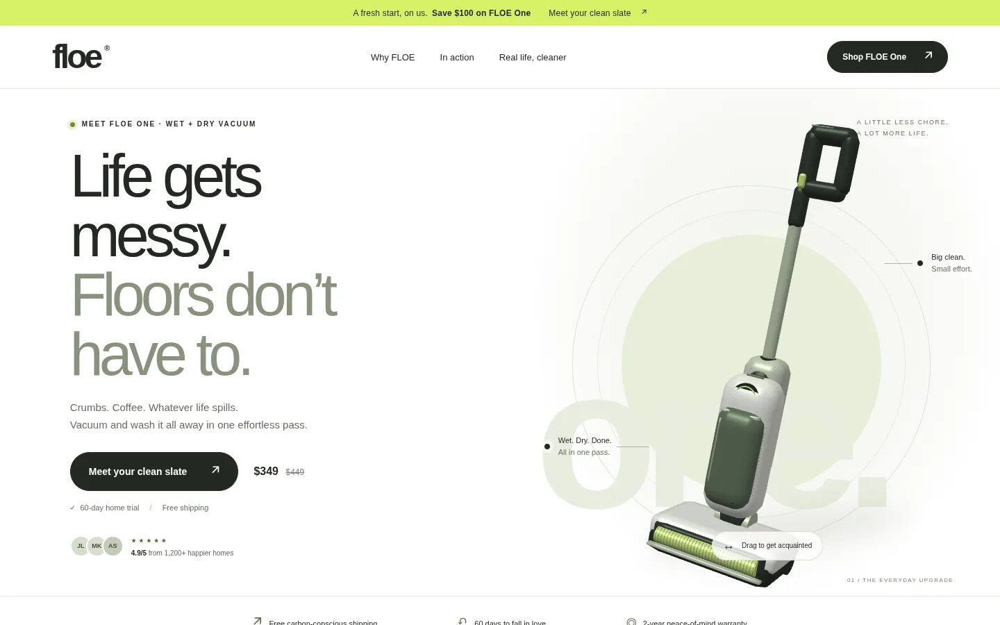 | 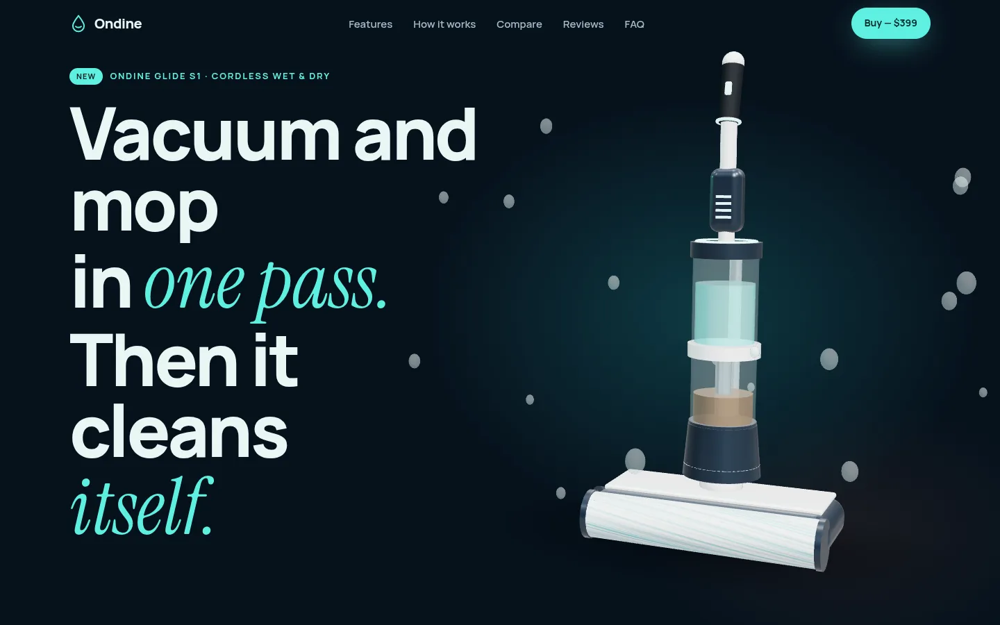 | 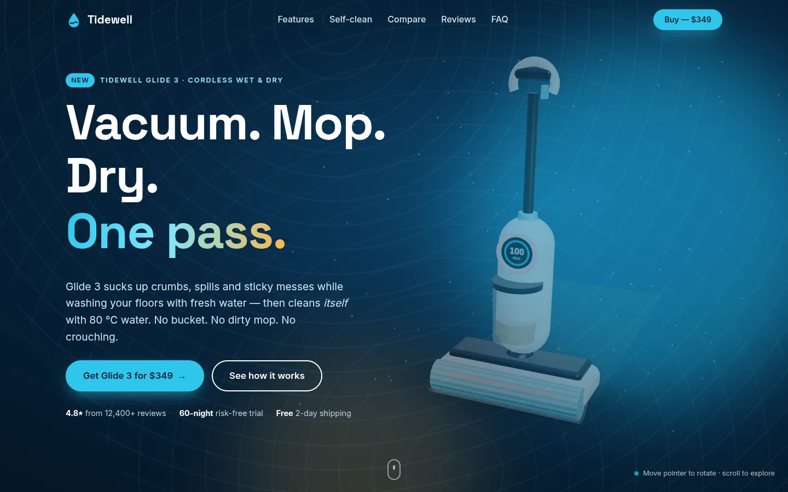 |

### Scroll-through (12 %, 30 %, 50 %, 75 % of page height)

| A — astra | B — opus | C — swarm |
|---|---|---|
| 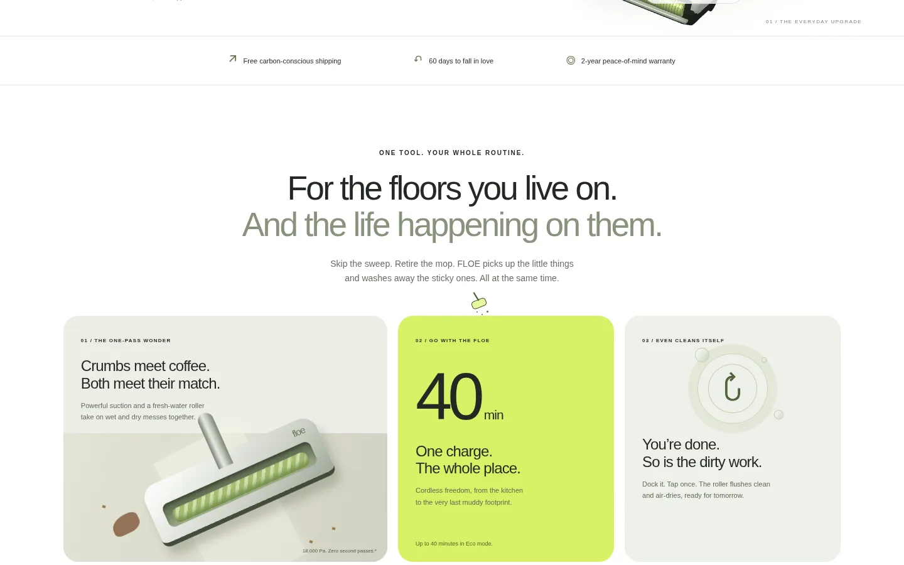 | 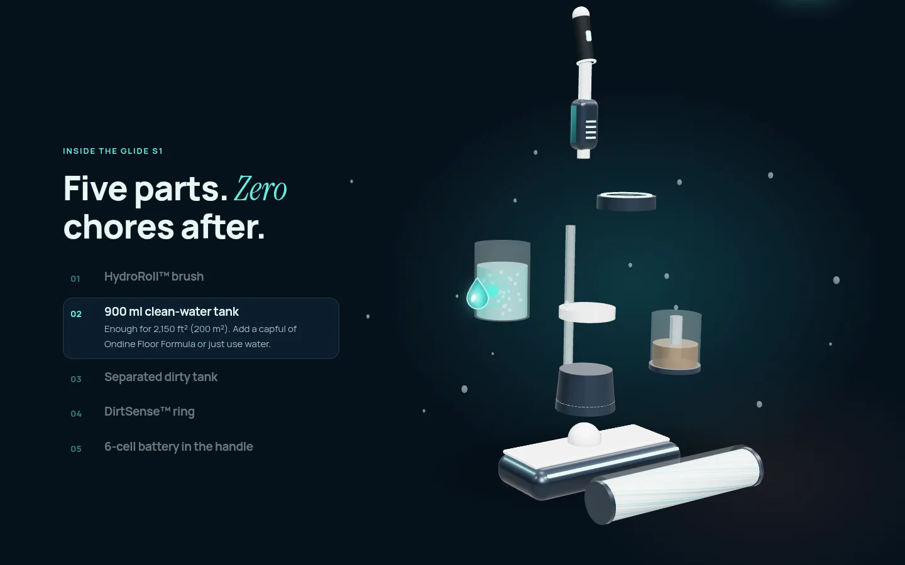 | 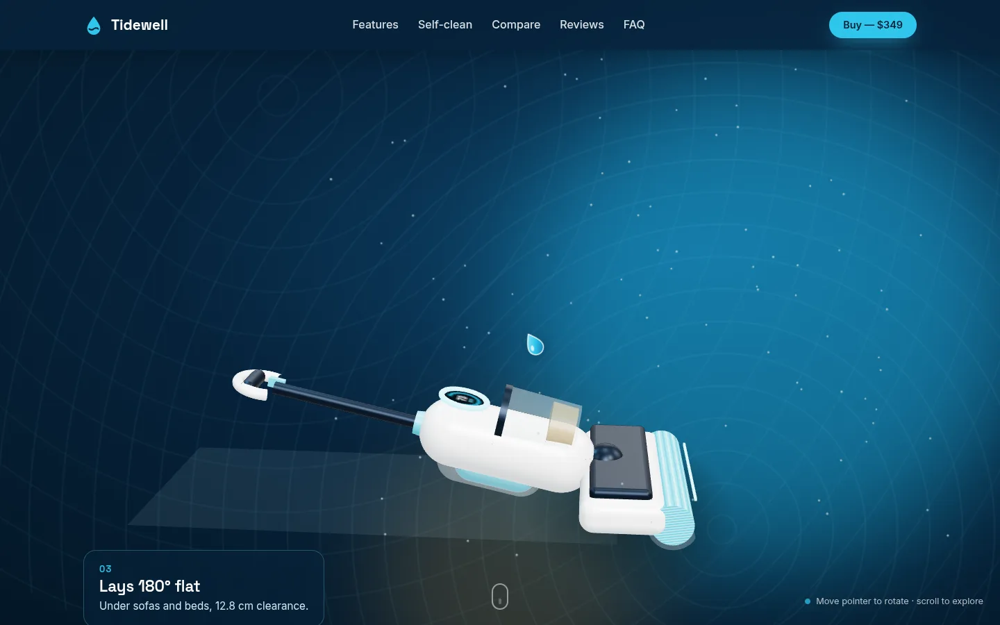 |
| 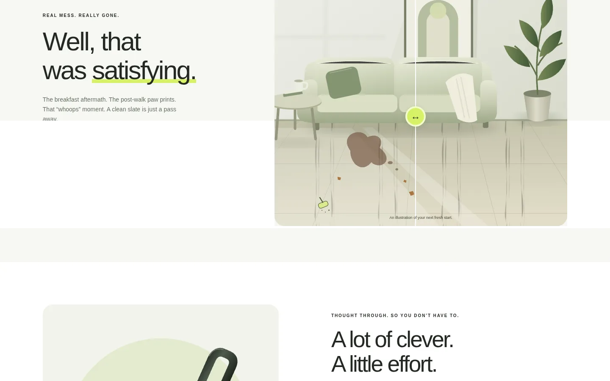 | 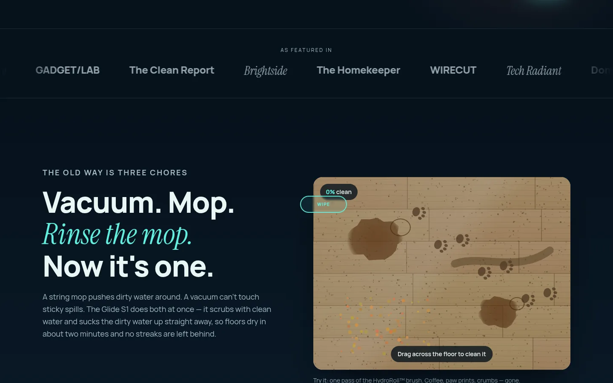 | 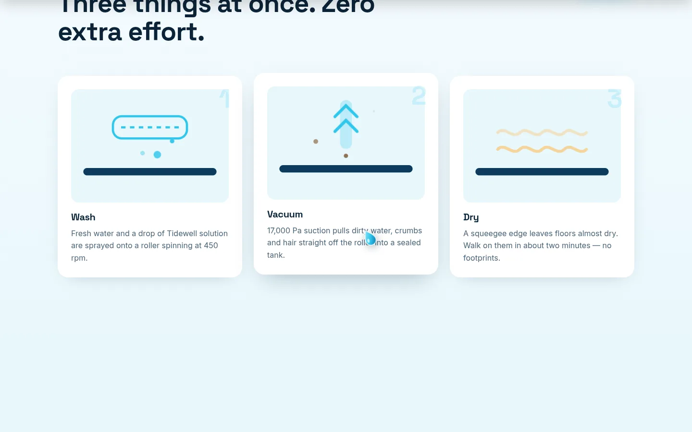 |
| 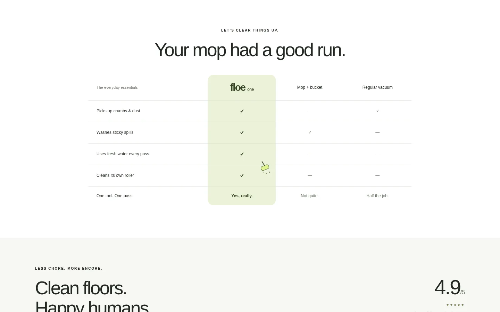 | 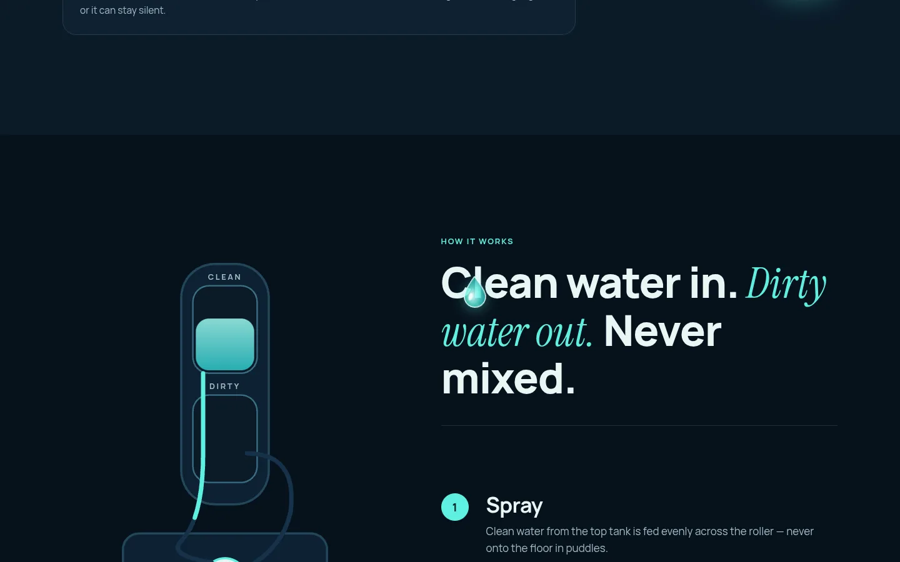 | 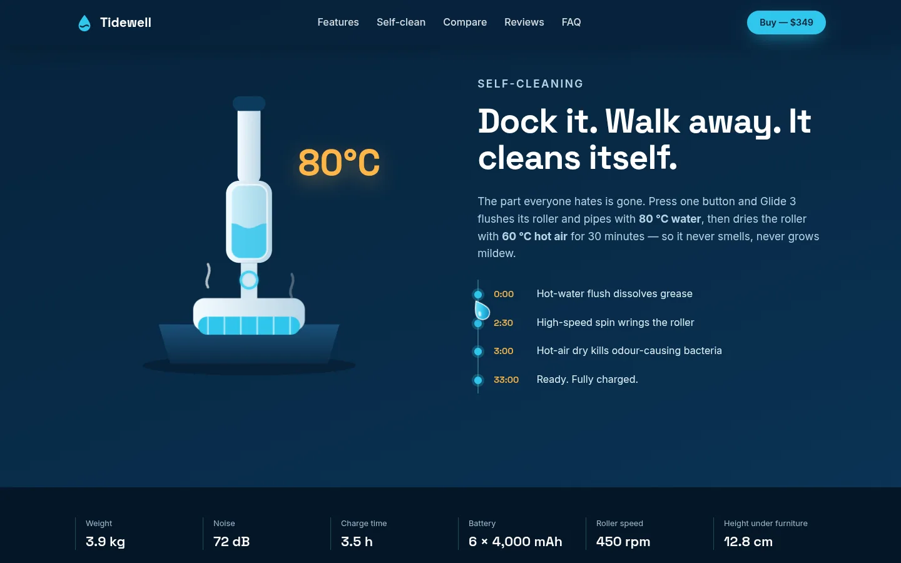 |
| 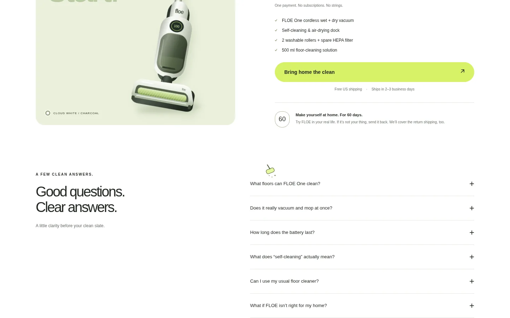 | 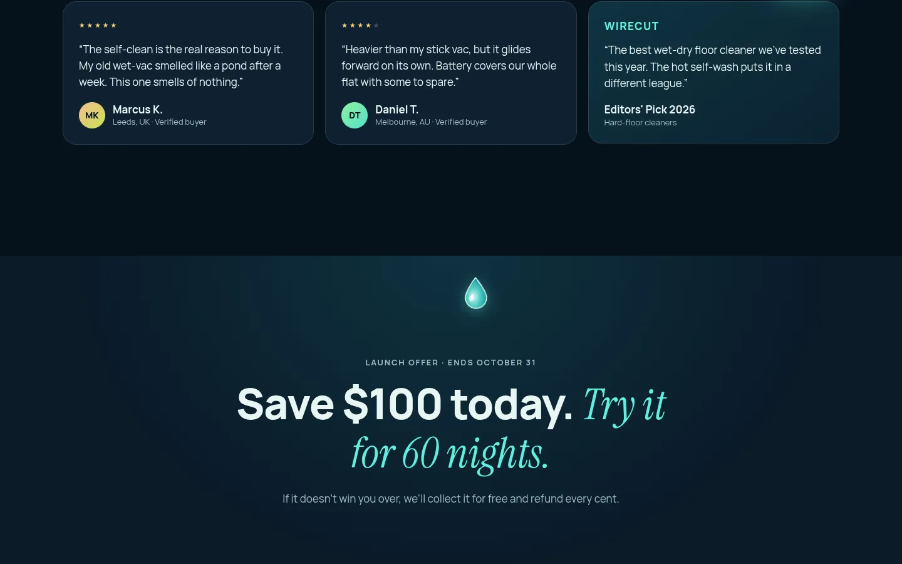 | 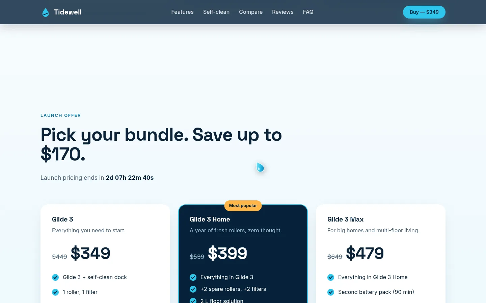 |

A's 30 % shot catches a reveal animation mid-flight; the section renders fully in the full-page capture.

### Mobile 375×812

| A — astra | B — opus | C — swarm |
|---|---|---|
| 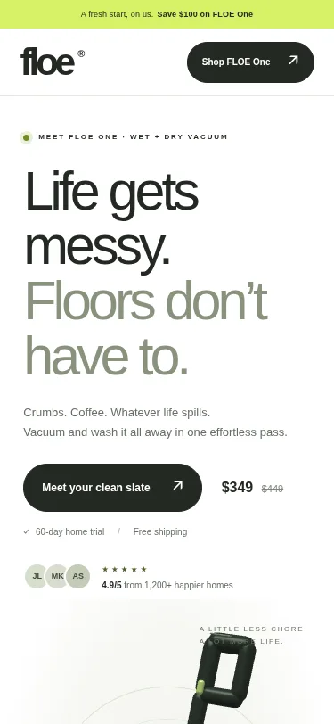 |  |  |

Full-page captures (desktop and mobile, 50 % scale): `screenshots/*-full.webp`.

## Observations

- **A (astra)**: the most premium, cohesive look (light, product-photography feel), the best-looking 3D model, the lightest page by 12×. 3D lives only in the hero (drag to rotate); animations are mostly reveals; one offer, no spec table.
- **B (opus)**: scroll-driven exploded view of the product, a drag-to-clean floor mini-game, an animated clean/dirty water diagram, droplet cursor. Weak spots: no CTA above the fold on desktop; the invented press strip includes "WIRECUT", uncomfortably close to a real publication.
- **C (swarm)**: the strongest sales page — three bundles, countdown, specs strip, comparison, mobile buy bar, CTA in the hero, scroll-driven 3D chapters. The model reads as toy-like and there are some empty gaps between sections.
- **Swarm dynamics**: all four round-1 answers were valid; round 2 was short (2–3 min per worker) polish. The judge ranked a2 > a1 > a4 ≈ a3 from code and diffs only — it never rendered a page (it says so under *Unresolved* in [runs/judge-verdict.md](runs/judge-verdict.md)).
- **Takeaway**: for a single-artifact creative task a strong solo model gives most of the value; the swarm pays off as a selection mechanism when you do not know in advance which model will be best, not as a quality multiplier. Giving the judge a browser would make its choice evidence-based.

## Files

- [`BRIEF.md`](BRIEF.md) — the task.
- [`sites/`](sites/) — the three final sites (static; `python3 -m http.server` inside `sites/`, open `/A-astra/`, `/B-opus/`, `/C-swarm/`). They load three.js and fonts from CDNs.
- [`screenshots/`](screenshots/) — captures used above.
- [`runs/`](runs/) — judge verdict, anonymous id map, per-call `.usage` (token/cost) files.
- [`eval/eval.mjs`](eval/eval.mjs) — Playwright: console errors, transfer size, overflow at 3 widths, reduced motion, a11y basics, SwiftShader FPS, screenshots. [`eval/fps.mjs`](eval/fps.mjs) — headed Chrome on the real GPU, frame times during scroll and pointer movement.

Reproduce the measurements:

```bash
cd docs/benchmarks/landing-ab/sites && python3 -m http.server 8801 --bind 127.0.0.1 &
PW_DIR=/path/to/node_modules/ node ../eval/eval.mjs        # PNGs go to ../screenshots
PW_DIR=/path/to/node_modules/ CH=/path/to/chrome node ../eval/fps.mjs
```
