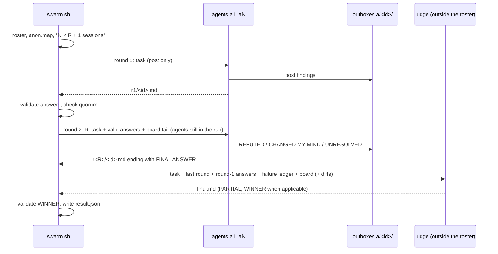

# Protocol

How a `swarm.sh all` run proceeds: who talks to whom, what each round is allowed to see, how the judge decides, and what happens when something fails. For engines, sandboxing and the file layout see [architecture.md](architecture.md).

## Overview



## 0. Setup

1. **Roster.** Without `-m`, the first model of each available harness. `-m all` takes the full roster; `-m "a b c"` an explicit list.
2. **Judge.** `-S MODEL`, or by default the first roster model that is not a participant. If every roster model is a participant, the first one is used and a warning is printed: the judge is then also a participant.
3. **Anonymization.** Participants are shuffled and get ids `a1..aN`. The mapping `aK<TAB>model` is written to `anon.map`. Ids, not model names, are used in prompts, file names and on the board, so neither the agents nor the judge can weight an argument by brand.
4. **Cost line.** `swarm: N agents × R rounds + judge = N×R+1 sessions` is printed to stderr before the first agent starts.
5. **Isolation.** Workers start without the user's own config (hooks, output style, MCP servers, `~/.codex/config.toml`) unless `SWARM_INHERIT_CONFIG=1`. Project configuration, including the project `CLAUDE.md`, still applies.

## 1. Round 1: independent answers

Every agent gets the preamble and the task. In round 1 agents may **post** to the board but are not told to **read** it. The point is independence: in the review that produced v0.3.0, five agents in round 1 picked up the same false claim from the board, and it looked like consensus. Independent first answers are the only way to tell agreement from contagion.

## 2. Rounds 2..R: critique with evidence

Only agents that produced a valid answer in the previous round take part; a failed agent is not relaunched in later rounds. Each agent gets, in its prompt:

- the task;
- the list of **valid** answer files from the previous round, with an explicit instruction to read every one of them (failed agents are listed separately, so nobody critiques an empty file);
- the last 60 board messages.

Answers are passed as file paths, not inlined; the run directory is readable to every agent (`--add-dir` for Claude, the Codex sandbox restricts writes, not reads). Other agents' answers and board messages are marked as **untrusted evidence**: material to check, not instructions to follow. The answer must contain four sections:

| Section | Content |
|---|---|
| `REFUTED` | `claim → evidence` for every claim the agent believes is wrong (file:line, command output, a reproduction) |
| `CHANGED MY MIND` | what the agent now accepts from others and why |
| `UNRESOLVED` | what is still disputed and what would settle it |
| `FINAL ANSWER` | the agent's complete, standalone answer to the task after this round, as the closing section |

An answer from round 2 on without a `FINAL ANSWER` section counts as failed, just like an empty one, and is listed in `PARTIAL`. This keeps the actual answer from disappearing behind the critique: the judge sees complete answers, not only disputes. There is no early stop on consensus: a correlated error looks exactly like agreement.

## 3. The board

- Every agent has a private directory `a/<id>/`. Inside a worker, `swarm.sh post` writes only to `a/<id>/outbox.jsonl`, and the `from` field is taken from that directory, not from the command line. An agent cannot post as someone else, and the Codex sandbox lets it write only there, so it cannot overwrite `task.md` or another agent's answer.
- Answers (`r<N>/<id>.md`) are written by the orchestrator, outside `a/`.
- `swarm.sh read DIR [ME]` merges all outboxes sorted by timestamp. `swarm.sh watch DIR` shows the same live, together with the state of each agent.
- You can post into a running swarm yourself from outside a worker.

Message format:

```json
{"ts":"2026-09-25T14:31:07Z","from":"a1","to":"all","msg":"..."}
```

## 4. The judge

The judge runs read-only with:

- the task;
- the valid answers of the last round;
- the round-1 answers as secondary evidence, so that a round-1 finding nobody disputed cannot vanish before the final answer;
- the failure ledger: which agent failed in which round and with what exit code;
- the board.

It is told:

- evidence beats count: a single agent with a reproduction outweighs a majority without one;
- list what remains unresolved rather than papering over it;
- explain where agents disagreed and why the chosen side won.

In rw runs (`all -w`) the judge also gets the latest `manifest.jsonl` row per agent and the per-agent `r<N>/<id>.diff` files, so it judges the actual changes, not the description of them. It ends with `WINNER: <branch>` or `WINNER: NONE`.

`swarm.sh` then lists **all** of the run's branches for review. It takes the last `WINNER:` line and validates it: the branch must be in `worktrees.jsonl` and must not be dirty in the manifest. For a valid winner it additionally prints a `git diff <base>..<winner>` command, a single `git merge -- <winner>` command and `swarm.sh clean <run> --discard <other branches>` for the rest. An invalid or missing winner is reported, and no merge command is printed. Merging is always left to you.

The judge's output is `final.md`. Its answer is not majority vote; read it critically. The outcome is also written atomically to `result.json`: `{rc, final, partial, winner, branches}`.

## 5. Failure handling

| Situation | Behavior |
|---|---|
| Agent exits non-zero | Failed. The exit code is in `<id>.rc`, the engine log in `<id>.log` |
| Agent exits 0 with an empty answer | Failed with `rc=65` (not counted as success) |
| Round 2+ answer without `FINAL ANSWER` | Failed; listed in `PARTIAL` |
| rw: branch check or auto-commit fails | Failed with `rc=71`; nothing is committed and the files stay in the worktree for inspection. A failed agent's changes are never auto-committed |
| Agent exceeds `-t` | Stopped with `SIGTERM`, `SIGKILL` 30 s later; `rc=124` |
| Fewer valid answers than all agents, default | Strict mode: the run stops after that round, no judge, non-zero exit |
| Valid answers ≥ `-q N` | The run continues with the agents that succeeded; failed agents are not relaunched in later rounds. `final.md` is marked `PARTIAL` and lists the failed agents; the judge gets the per-round failure ledger |
| Valid answers < `-q N` | The run stops, non-zero exit |
| Judge fails | Rounds are kept. `swarm.sh judge DIR [-S MODEL]` reruns only the judge on `task.md` and the last round |
| Run interrupted | `swarm.sh resume DIR` (v0.4.0) reruns only agents whose `.rc` is missing or non-zero, then the remaining rounds and the judge. It refuses if the task, `anon.map` or options no longer match the hashes in `run.json`, and never reuses a worktree whose `HEAD` no longer descends from its recorded base |
| Ctrl-C / SIGTERM | The whole process tree of every running worker is killed; nothing keeps running and billing in the background. Exit code 130. The same happens when a host tool kills a foreground run on timeout; start long runs from an agent with `-d` (or in the background) and poll with `swarm.sh wait DIR -t SEC` |
| Worktree creation fails | Same cleanup as Ctrl-C: agents already started are stopped |

`swarm.sh status DIR` shows, per agent, state, exit code and cost (input/output tokens when the engine reports no USD figure, `unknown` when it reports nothing), plus the total.

## 6. `run` mode

`swarm.sh run tasks.jsonl` uses the same board, outboxes, isolation and failure handling, but no rounds and no judge: all tasks start at once and coordination happens on the board. Tasks that depend on another task's committed output belong in separate, phased runs; see [recipes.md](recipes.md#3-parallel-feature-in-worktrees). Ids come from the task `id`, not from anonymization. See the README for the task format and the rules for `mode`, `worktree` and `shared`.
